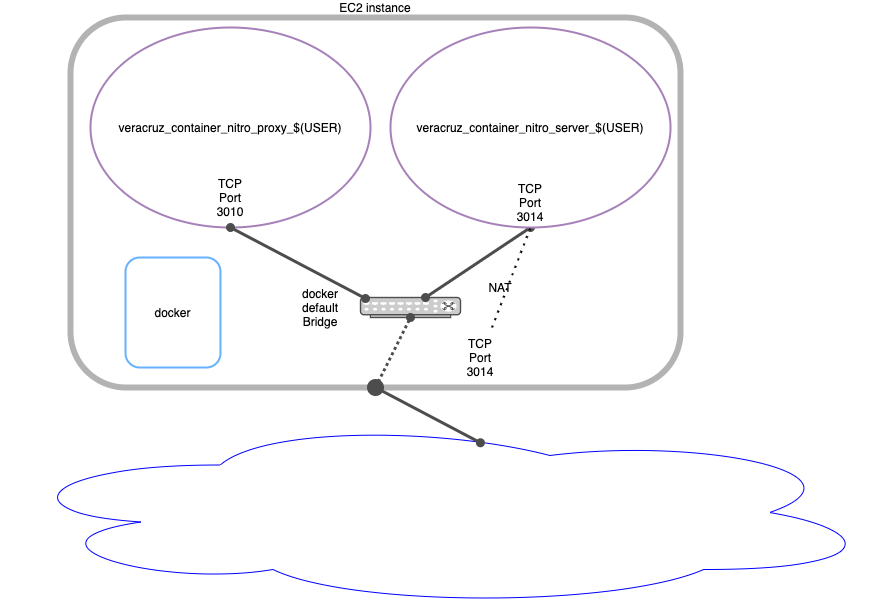

# Running Veracruz on a AWS EC2 Nitro instance using dockefr

This example shows how to run a Veracruz example, linear-regression, using a docker image using a nitro-enabled EC2 instance.
A docker environment can be used to partition the full application and help develop and validate the Veracruz user application code that runs inside Veracruz. This configuration is recommended for validating wasm applications, testing keys or validating user facing applications.

<center>



</center>

## Infrastructure 

* 1 EC2 instance that is nitro enabled. 
    * Just for reference in the tests a C5.xlarge machine was used.
    * It is also recommended to use Amazon Linux since installing the nitro tools are much easier
    * Follow this procedure to enable nitro on this instance [Installing the Nitro Enclaves CLI on Linux](https://docs.aws.amazon.com/enclaves/latest/user/nitro-enclave-cli-install.html)
    * Install docker 
      * On Amazon Linux 2
         ```bash
         sudo yum install docker
	 sudo usermod -a -G docker ec2-user
         ```
      * On Ubuntu/Debian
	```bash
	sudo apt-get install docker.io
	sudo usermod -a -G docker ubuntu
	```
    * logout and login again and verify that docker is available
      ```bash
      docker version
      ```

* Networking configuration
    * This guide assumes that all access will be from machines on the same VPC as the EC2 instance running Veracruz. External access can be enabled but require some care on selection os DNS name and some configuration of the /etc/hosts on the container so the policy is valid for both veracruz-server and the user application.

## Running Veracruz

### Setting up the environment

* Clone this repository at EC2 machine. 
  ```bash
  git clone <>
  ```
* Run makefile to create the keys and the policy from the template
  ```bash
  make
  ```

## Starting the containers

Veracruz nitro requires two server applications to be running so wasm applications can be deployed.

* Veracruz attestation service (proxy attestation)
    * Requirements
      * Proxy attestation container DOES NOT require nitro
      * CA certificate and the corresponding key are necessary (it should have been generated in a previous step)
    * Run
      * Execute:
        ```bash
	make run-proxy
	``` 
      * Troubleshooting:
        ```bash
	make run-proxy-check
	``` 
        * The --rm option on docker run removes the container logs after the container exits so to debug remove the --rm option and rerun the docker command
        * execute the following commands to get the container ID, the previous command output (docker run also outputs the container ID):
           ```bash
           docker ps -a 
           ```
        * locate the container ID of the container you want to get the logs and run
           ```bash
           docker logs <container ID>
           ```
        * Remove the exited container after reading the logs (or finished debugging by executing
           ```bash
           docker rm <container ID>
           ```

* Veracruz server
   * Requirements
     * A Veracruz proxy attestation running that is accessible by the policy. 
  * Run
    ```bash
    make run-server
    ``` 
    * <em><strong>Remember that local files names provided (-v options) have to include full path. Partial paths will not work correctly</strong></em>
    * Docker default bridge does not support resolving container IP address by the container name. Instead of requiring a new bridge to run this example the "--add-host" option is used to create an entry so the server can find the proxy by the referenced name on the policy. Adjust this if your network configuration is different.
 * Verification
   * Check the logs of the veracruz-server container to ascertain that Veracruz started correctly
     ```bash
     make run-server-check
     ```
* Using Veracruz
 * The container image has a veracruz-client application that can interact with veracruz instances. The following coommand starts a container that can be used to execute the veracruz-client application
   ```bash
   make run-client
   ```
 * Loading a program referenced in the policy. 
     ```
     make run-client-exec-load-program
     ```
 * Loading data referenced in the policy
     ```
     make run-client-exec-load-data
     ```
 * Reading output
     ```
     make run-client-exec-read-output
     ```
