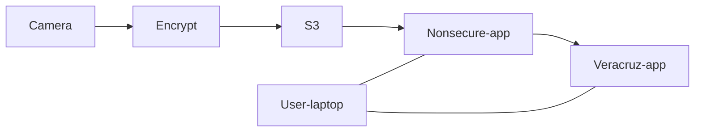

# i-poc

The i-PoC is an end-to-end example of using veracruz to run confidential computing functions in the cloud. The example runs on AWS and utilizes AWS Nitro.

This is the high level Iotex PoC description.  The key here is that the processing of the video is triggered by the user from their laptop (in the example), and the object detection happens in Nitro Enclaves on top of Veracruz.  



The primary components of the example are:
* Veracruz runtime
* Cloud infrastructure that runs on kubernetes
   * VaaS (Veracruz as a Service)
   * CCFaaS (Confidential Computing Function as a Service)
   * iotex-s3-app: copies files from S3 to a veracruz instance
* iotex-user-app: represents the end user application
* VOD: veracruz application that process the decrypt and process the video 

The following figure describe the application in more detail. The figure shows the components, communications path and information exchanged.
In the figure if a symbol is close to an entity, it means that this entity is sending that data (symbol).
Timeline is not shown in the diagram and it will be described later.

<center>


</center>

A timeline of a full operation is described below.

1. Administrator register privacy preserving functions at CCFaaS
   * Function name, application code (wasm), hash, input/output requirements of the application code and others.
1. User application creates a temporary key and certificate to be used by the Iotex S3 app application to access the Veracruz instance.
   * Light blue key and certificate on the diagram
1. User application creates a json object with the following information:
   * name of function to be executed in privacy-preserving environment (object detection for example)
   * a certificate for each input/output file of the privacy-preserving environment
     * In the object detection example described: 
        * user application certificate as output
          * Dark blue certificate
        * temporary created certificate as input
          * Light blue certificate
1. User application executes a remote procedure call request to the CCFaaS service with previously created json object 
   * Lower pink FaaS arrow
1. CCFaaS validates the request and creates a valid policy request json object based on the request and internal database (object detection application code, certificates to load the code into Veracruz)
1. CCFaaS executes a RPC at VaaS requesting an instance of Veracruz running that policy
1. VaaS validates that request and starts a Veracruz instance in the allocated EC2 nitro with a complete policy
1. VaaS returns the complete policy to CCFaaS
1. CCFaaS loads the desired Veracruz user application code (object detection) into the Veracruz instance directly or asks another service to load it.
1. CCFaaS returns created Veracruz policy to User Application After application program code is loaded
1. CCFaaS and VaaS waits for the next request (it will not interact with this request anymore)
1. User Application receives the policy 
1. User Application connects directly to Veracruz instance (using the connection information provided in the policy) and verify that the policy hash matches and the certificate provided by Veracruz instance is valid (attested by the proxy)
1. User application creates a file in Veracruz instance with the video decrypting key
1. User application creates a json object with the following information:
   * AWS S3 bucket, file name of the desired video and credentials to access the file
   * Veracruz instance endpoint (host, IP).
   * temporary certificate and key generated previously to access Veracruz instance
1. User application executes a remote procedure call request to the Iotex S3 app with previously created json object
   * Upper pink FaaS arrow
1. Iotex S3 app starts an instance of itself that connects to AWS S3 and Veracruz instance, reads the video file and sends it to the Veracruz instance
1. Iotex S3 app instance closes the connection to Veracruz at the end of the file and terminates itself.
1. User application executes the program inside the enclave using the provided video
1. Veracruz instance process the video and writes the results to the output file
1. User application reads results file and terminates the Veracruz instance using CCFaaS
1. EC2 nitro instance is returned to the pool of free instances to be allocated.

# VOD

VOD is the application that runs inside veracruz, It provides privacy preserving image processing using ML. Please check the [README](https://github.com/veracruz-project/video-object-detection/tree/iotex-demo#readme) of the VoD example.
 
# Veracruz Policy

Veracruz Policy for the purpose of the example is divided intro three parts: Infrastructure policy, Program policy and User policy. 

* Infrastructure policy describes the Veracruz instance: endpoint that has this policy, runtime properties (hash and others) and which proxy attestation server is used by this Veracruz instance.
    * This portion is set by VaaS
* Program policy describe the executables used on the computation. For each executable the policy has the identity (certificate) of the entity allowed to load this executable, name, hash, inputs and outputs of the program and file rights that the program has on each input/output file.
    * This portion is provided when a function is registered on CCFaaS
* User policy describe identities (certificates) of the entities that can communicate with that Veracruz instance, which files and in which action (read/write/etc) it is allowed to interact with.
    * This portion is provided when a function is instantiated on CCFaaS

## Policy examples and syntax

The syntax of the policies will be described using [json Schema](ttps://json-schema.org).

* User Policy
   
   ```json
    {
       "function":"vod",
       "instanceid": "uniqueID",
       "identities": [
           {
               "certificate": "-----BEGIN CERTIFICATE-----\nXXXXXXXXX\n-----END CERTIFICATE-----",
               "file_rights": [
                   {
                       "file_name": "/s3_app_input/",
                       "rights": 534084
                   }
               ]
           },
           {
               "certificate": "-----BEGIN CERTIFICATE-----\nYYYYYYYYY\n-----END CERTIFICATE-----",
               "file_rights": [
                   {
                       "file_name": "/user_input/",
                       "rights": 534084
                   },
                   {
                        "file_name": "/output/",
                        "rights": 24582
                   },
                   {
                        "file_name": "stdout",
                        "rights": 24582
                   },
                   {
                        "file_name": "stderr",
                        "rights": 24582
                   },
                   {
                        "file_name": "/program/",
                        "rights": 536879104
                   }
               ]
           }
       ]
    }
   ```

   This policy defines two identities. The first one only has write access to the directory /s3_app_input/. The other has access to execute programs on the directory "/program" and read/write access to /user_input/,/output/,stdout and stderr.
 
   The following json-schema describes the schema allowed when an user policy is provided. CCFaaS only accepts user policies that pass this schema.

   ```json
    json_file_rights_schema = {
        "type": "array",
        "items" : {
            "type": "object",
            "properties": {
                 "file_name": { "type": "string"},
                 "rights": { "type": "integer"},
            },
            "additionalProperties": False
        },
        "additionalProperties": False
    }

    json_identity_schema = {
        "type": "array",
        "items" : {
             "type": "object",
             "properties": {
                 "file_rights": json_file_rights_schema,
                 "certificate":  { "type":"string" },
             },
             "required": ["file_rights","certificate"],
             "additionalProperties": False
        },
        "additionalProperties": False
    }

    json_policy_input_schema = {
        "$schema": "https://json-schema.org/draft/2020-12/schema",
        "type": "object",
        "properties": {
            "instanceid": { "type": "string"},
            "function": { "type": "string"},
            "identities":  json_identity_schema,
        },
        "required": ["function","instanceid","identities"],
        "additionalProperties": False
    }
   ```

   * <strong>function</strong>: identifies the registered function to instantiate
   * <strong>instanceid</strong>: unique name for this instance
   * <strong>identities</strong>: list of certificates and permissions allowed for each identity
   * <strong>certificate</strong>: x509 certificate in PEM format (currently veracruz-client only supports RSA certificates). Each identity should have a different certificate. Multiple identities using the same certificate will cause problems since only one identity file rights will be used to verify if the access is allowed. 
   * <strong>file_rights</strong>: List of filenames and permissions associated with that file for this identity
   * <strong>file_name</strong>: file that permissions apply (this file should exist on the registered function):
   * <strong>rights</strong>: Permissions that will be granted for that identity and file_name. Interpreted as a binary number according to the table below

      ```
      FD_DATASYNC               = 2^0 = 1
      FD_READ                   = 2^1 = 2
      FD_SEEK                   = 2^2 = 4
      FD_FDSTAT_SET_FLAGS       = 2^3 = 8
      FD_SYNC                   = 2^4 = 16
      FD_TELL                   = 2^5 = 32
      FD_WRITE                  = 2^6 = 64
      FD_ADVISE                 = 2^7 = 128
      FD_ALLOCATE               = 2^8 = 256
      PATH_CREATE_DIRECTORY     = 2^9 = 512
      PATH_CREATE_FILE          = 2^10 = 1024
      PATH_LINK_SOURCE          = 2^11 = 2048
      PATH_LINK_TARGET          = 2^12 = 4096
      PATH_OPEN                 = 2^13 = 8192
      FD_READDIR                = 2^14 = 16384
      PATH_READLINK             = 2^15 = 32768
      PATH_RENAME_SOURCE        = 2^16 = 65536
      PATH_RENAME_TARGET        = 2^17 = 131072
      PATH_FILESTAT_GET         = 2^18 = 262144
      PATH_FILESTAT_SET_SIZE    = 2^19 = 524288
      PATH_FILESTAT_SET_TIMES   = 2^20 = 1048576
      FD_FILESTAT_GET           = 2^21 = 2097152
      FD_FILESTAT_SET_SIZE      = 2^22 = 4194304
      FD_FILESTAT_SET_TIMES     = 2^23 = 8388608
      PATH_SYMLINK              = 2^24 = 16777216
      PATH_REMOVE_DIRECTORY     = 2^25 = 33554432
      PATH_UNLINK_FILE          = 2^26 = 67108864
      POLL_FD_READWRITE         = 2^27 = 134217728
      SOCK_SHUTDOWN             = 2^28 = 268435456
      FILE_EXECUTE              = 2^29 = 536870912
      ```

      In the example above:

         * 533572 = 2^2 + 2^6 + 2^10 + 2^13 + 2^19
            * FD_READ
            * FD_WRITE
            * PATH_CREATE_FILE
            * PATH_OPEN
            * PATH_FILESTAT_SET_SIZE
         * 8198 = 2^1 + 2^2 + 2^13 
            * FD_READ
            * FD_SEEK
            * PATH_OPEN.

* Program Policy

   ```json
    {
        "function": "vod",
        "debug": true,
        "enable_clock": true,
        "execution_strategy": "JIT",
        "max_memory_mib": 2000,
        "data_files": [
            {
                "data_file": "/input/coco.names",
                "pi_hash": "634a1132eb33f8091d60f2c346ababe8b905ae08387037aed883953b7329af84"
            },
            {
                "data_file": "/input/yolov3.cfg",
                "pi_hash": "2ca0ab366618b5c005931e057e9cef2e40a1988e2481b3cbd960047c8ec11995"
            },
            {
                "data_file": "/input/yolov3.weights",
                "pi_hash": "523e4e69e1d015393a1b0a441cef1d9c7659e3eb2d7e15f793f060a21b32f297"
            }
        ],
        "programs": [
            {
                "file_rights": [
                    {
                        "file_name": "/input/",
                        "rights": 24582
                    },
                    {
                        "file_name": "/output/",
                        "rights": 550470
                    },
                    {
                        "file_name": "stdout",
                        "rights": 534084
                    },
                    {
                        "file_name": "stderr",
                        "rights": 534084
                    }
                ],
                "id": 0,
                "pi_hash": "7612e3490f14a9ee523f357e86f97098a94678f4e06c8202cf307d163db9f7aa"
                "program_file_name": "/program/detector.wasm"
            }
        ],
        "file_rights": [
            {
                "file_name": "/program/",
                "rights": 537404996
            },
            {
                "file_name": "/input/",
                "rights": 537404996
            },
            {
                "file_name": "/output/",
                "rights": 537404996
            }
        ]
    }
   ```

   This policy defines a function that has a single program executable "/program/detector.wasm" and three data files. It also allows the program to access the /input, /output, stdout and stderr. Take not that no identities are defined here.

   The following json-schema describes the schema allowed when an function policy is provided. CCFaaS only accepts function policies that pass this schema.

   ```json
    json_file_rights_schema = {
        "type": "array",
        "items" : {
            "type": "object",
            "properties": {
                 "file_name": { "type": "string"},
                 "rights": { "type": "integer"},
            },
            "additionalProperties": False
        },
        "additionalProperties": False
    }

    json_program_schema = {
        "type": "array",
        "items" : {
             "type": "object",
             "properties": {
                 "file_rights": json_file_rights_schema,
                 "id": { "type":"integer" },
                 "pi_hash":  { "type":"string" },
                 "program_file_name":  { "type":"string" },
             },
             "required": ["file_rights","id","pi_hash","program_file_name"],
             "additionalProperties": False
        },
        "additionalProperties": False
    }

    json_data_file_schema = {
        "type": "array",
        "items" : {
             "type": "object",
             "properties": {
                 "data_file":  { "type":"string" },
                 "pi_hash":  { "type":"string" },
                 "priority": { "type":"integer" }
             },
             "required": ["pi_hash","data_file"],
             "additionalProperties": False
        },
        "additionalProperties": False
    }

    json_policy_input_schema = {
        "$schema": "https://json-schema.org/draft/2020-12/schema",
        "type": "object",
        "properties": {
            "function": { "type": "string"},
            "execution_strategy": { "type": "string"},
            "max_memory_mib": { "type": "integer"},
            "programs":  json_program_schema,
            "data_files": json_data_file_schema,
            "file_rights": json_file_rights_schema,
            "debug": { "type": "boolean"},
            "enable_clock": { "type": "boolean"}
        },
        "required": ["function","execution_strategy","max_memory_mib", "programs", "debug","enable_clock", "file_rights"],
        "additionalProperties": False
    }
   ```

   * <strong>function</strong>: identifies the function name to register
   * <strong>execution_strategy</strong>: normally "Interpretation" but other modes may be supported in the future
   * <strong>max_memory_mib</strong>: minimum amount of memory on the enclave to run this application
   * <strong>debug</strong>: running on debug mode if true
   * <strong>enable_clock</strong>: clock in enclave has current time and date if true
   * <strong>programs</strong>: list of programs (executables) that is part of the computation for this function (all of them are instantiated for this function to execute correctly)
   * <strong>file_rights</strong>: List of filenames and permissions associated with this program
   * <strong>pi_hash</strong>: sha256 hash of the executable or data file
   * <strong>data_files</strong>: list of optional data files to be loaded into the programs. The order they are loaded are determined by the priority, lower numbers before higher numbers, same numbers are loaded in random order. 
   * <strong>data_file</strong>: name of the file to be loaded and also the name of input file of the program
   * <strong>priority</strong>: (optional field) lower numbers will have higher priority on loading 
   * <strong>program_file_name</strong>: name for the program as known by Veracruz
   * <strong>file_name</strong>: file that permissions apply (in current veracruz implementation, this should be a directory, file_rights cannot be applied to individual files)

* VaaS policy (policy used by VaaS to create a Veracruz instance)

   ```json
    {
        "instance_id" : "instance1",
        "ciphersuite": "TLS1_3_CHACHA20_POLY1305_SHA256",
        "debug": true,
        "enable_clock": true,
        "execution_strategy": "JIT",
        "max_memory_mib": 2000,
        "programs": [
            {
                "file_rights": [
                    {
                        "file_name": "/program_data/",
                        "rights": 24582
                    },
                    {
                        "file_name": "/s3_app_input/",
                        "rights": 24582
                    },
                    {
                        "file_name": "/user_input/",
                        "rights": 24582
                    },
                    {
                        "file_name": "/output/",
                        "rights": 550470
                    },
                    {
                        "file_name": "/program_internal/",
                        "rights": 550470
                    },
                    {
                        "file_name": "stdout",
                        "rights": 534084
                    },
                    {
                        "file_name": "stderr",
                        "rights": 534084
                    }
                ],
                "id": 0,
                "program_file_name": "/program/detector.wasm"
            }
        ],
        "identities": [
            {
                "certificate": "-----BEGIN CERTIFICATE-----\nXXXXXXXXX\n-----END CERTIFICATE-----",
                "file_rights": [
                    {
                        "file_name": "/s3_app_input/",
                        "rights": 534084
                    }
                ],
                "id": 0
            },
            {
                "certificate": "-----BEGIN CERTIFICATE-----\nYYYYYYYYY\n-----END CERTIFICATE-----",
                "file_rights": [
                    {
                        "file_name": "/user_input/",
                        "rights": 534084
                    },
                    {
                        "file_name": "/output/",
                        "rights": 24582
                    },
                    {
                        "file_name": "stdout",
                        "rights": 24582
                    },
                    {
                        "file_name": "stderr",
                        "rights": 24582
                    },
                    {
                        "file_name": "/program/",
                        "rights": 536879104
                    }
                ],
                "id": 1
            },
            {
                "certificate": "-----BEGIN CERTIFICATE-----\nPPPPPPPPP\n-----END CERTIFICATE-----",
                "file_rights": [
                    {
                        "file_name": "/program/",
                        "rights": 534084
                    },
                    {
                        "file_name": "/program_data/",
                        "rights": 534084
                    }
                ],
                "id": 2
            }
        ],
        "file_hashes": [
            {
                "file_path": "/program/detector.wasm",
                "hash": "7612e3490f14a9ee523f357e86f97098a94678f4e06c8202cf307d163db9f7aa"
            },
            {
                "file_path": "/program_data/coco.names",
                "hash": "634a1132eb33f8091d60f2c346ababe8b905ae08387037aed883953b7329af84"
            },
            {
                "file_path": "/program_data/yolov3.cfg",
                "hash": "2ca0ab366618b5c005931e057e9cef2e40a1988e2481b3cbd960047c8ec11995"
            },
            {
                "file_path": "/program_data/yolov3.weights",
                "hash": "523e4e69e1d015393a1b0a441cef1d9c7659e3eb2d7e15f793f060a21b32f297"
            }
        ],
        "enclave_cert_expiry": {
            "day": 11,
            "hour": 16,
            "minute": 46,
            "month": 4,
            "year": 2023
        },
    }
   ```

   This policy is the corresponding policy that CCFaaS sends to VaaS when the function "vod" is instantiated as "instance1". It also represents a policy that VaaS requires when a veracruz instance is requested.
   In this policy a third identity is provided "-----BEGIN CERTIFICATE-----\nPPPPPPPPP\n-----END CERTIFICATE-----" that allows the programs to be provided. It only allows writing to the programs and program_data directory so it can provision the program.

   The following json-schema describes the schema allowed. 

   ```json
    json_file_rights_schema = {
        "type": "array",
        "items" : {
            "type": "object",
            "properties": {
                 "file_name": { "type": "string"},
                 "rights": { "type": "integer"},
            },
            "additionalProperties": False
        },
        "additionalProperties": False
    }

    json_identity_schema = {
        "type": "array",
        "items" : {
            "type": "object",
            "properties": {
                 "certificate": { "type": "string"},
                 "file_rights": json_file_rights_schema,
                 "id": { "type":"integer" },
            },
            "required": ["certificate","file_rights","id"],
            "additionalProperties": False
        },
        "additionalProperties": False
    }

    json_program_schema = {
        "type": "array",
        "items" : {
             "type": "object",
             "properties": {
                 "file_rights": json_file_rights_schema,
                 "id": { "type":"integer" },
                 "program_file_name":  { "type":"string" },
             },
             "required": ["file_rights","id","program_file_name"],
             "additionalProperties": False
        },
        "additionalProperties": False
    }

    json_file_hash_schema = {
        "type": "array",
        "items" : {
             "type": "object",
             "properties": {
                 "file_path": { "type":"string" },
                 "hash":  { "type":"string" },
             },
             "required": ["file_path","hash"],
             "additionalProperties": False
        },
        "additionalProperties": False
    }

    json_enclave_cert_expiry_schema = {
        "type": "object",
        "properties": {
            "day": { "type": "integer"},
            "hour": { "type": "integer"},
            "minute": { "type": "integer"},
            "month": { "type": "integer"},
            "year": { "type": "integer"},
        },
        "required": ["day","hour","minute","month","year"],
        "additionalProperties": False
    }

    json_policy_input_schema = {
        "$schema": "https://json-schema.org/draft/2020-12/schema",
        "type": "object",
        "properties": {
            "instance_id": { "type": "string"},
            "ciphersuite": { "type": "string"},
            "debug": { "type": "boolean"},
            "enable_clock": { "type": "boolean"},
            "execution_strategy": { "type": "string"},
            "max_memory_mib": { "type": "integer"},
            "identities": json_identity_schema,
            "programs":  json_program_schema,
            "file_hashes":  json_file_hash_schema,
            "enclave_cert_expiry": json_enclave_cert_expiry_schema,
        },
        "required": ["ciphersuite","debug","enable_clock","execution_strategy", "max_memory_mib", "identities","programs"],
        "additionalProperties": False
    }
   ```

   * <strong>instance_id</strong>: allows identification of this instance for the purpose of VaaS
   * <strong>ciphersuite</strong>: identifies what are the algorithms to be used for cryptographic operations (TLS, hashing,  keys signing, etc..)

* Full policy (policy returned by CCFaaS and VaaS and used in Veracruz instance)

   ```json
    {
        "ciphersuite": "TLS1_3_CHACHA20_POLY1305_SHA256",
        "debug": true,
        "enable_clock": true,
        "execution_strategy": "JIT",
        "max_memory_mib": 2000,
        "programs": [
            {
                "file_rights": [
                    {
                        "file_name": "/program_data/",
                        "rights": 24582
                    },
                    {
                        "file_name": "/s3_app_input/",
                        "rights": 24582
                    },
                    {
                        "file_name": "/user_input/",
                        "rights": 24582
                    },
                    {
                        "file_name": "/output/",
                        "rights": 550470
                    },
                    {
                        "file_name": "/program_internal/",
                        "rights": 550470
                    },
                    {
                        "file_name": "stdout",
                        "rights": 534084
                    },
                    {
                        "file_name": "stderr",
                        "rights": 534084
                    }
                ],
                "id": 0,
                "program_file_name": "/program/detector.wasm"
            }
        ],
        "identities": [
            {
                "certificate": "-----BEGIN CERTIFICATE-----\nXXXXXXXXX\n-----END CERTIFICATE-----",
                "file_rights": [
                    {
                        "file_name": "/s3_app_input/",
                        "rights": 534084
                    }
                ],
                "id": 0
            },
            {
                "certificate": "-----BEGIN CERTIFICATE-----\nYYYYYYYYY\n-----END CERTIFICATE-----",
                "file_rights": [
                    {
                        "file_name": "/user_input/",
                        "rights": 534084
                    },
                    {
                        "file_name": "/output/",
                        "rights": 24582
                    },
                    {
                        "file_name": "stdout",
                        "rights": 24582
                    },
                    {
                        "file_name": "stderr",
                        "rights": 24582
                    },
                    {
                        "file_name": "/program/",
                        "rights": 536879104
                    }
                ],
                "id": 1
            },
            {
                "certificate": "-----BEGIN CERTIFICATE-----\nPPPPPPPPP\n-----END CERTIFICATE-----",
                "file_rights": [
                    {
                        "file_name": "/program/",
                        "rights": 534084
                    },
                    {
                        "file_name": "/program_data/",
                        "rights": 534084
                    }
                ],
                "id": 2
            }
        ],
        "file_hashes": [
            {
                "file_path": "/program/detector.wasm",
                "hash": "7612e3490f14a9ee523f357e86f97098a94678f4e06c8202cf307d163db9f7aa"
            },
            {
                "file_path": "/program_data/coco.names",
                "hash": "634a1132eb33f8091d60f2c346ababe8b905ae08387037aed883953b7329af84"
            },
            {
                "file_path": "/program_data/yolov3.cfg",
                "hash": "2ca0ab366618b5c005931e057e9cef2e40a1988e2481b3cbd960047c8ec11995"
            },
            {
                "file_path": "/program_data/yolov3.weights",
                "hash": "523e4e69e1d015393a1b0a441cef1d9c7659e3eb2d7e15f793f060a21b32f297"
            }
        ],
        "enclave_cert_expiry": {
            "day": 11,
            "hour": 16,
            "minute": 46,
            "month": 4,
            "year": 2023
        },
        "proxy_attestation_server_url": "veracruz-nitro-proxy:3010",
        "proxy_service_cert": "-----BEGIN CERTIFICATE-----\nZZZZZZZZZ\n-----END CERTIFICATE-----",
        "runtime_manager_hash_nitro": "f2ae0de7bec92bcdbd4a96e2ae08d85a575f1aa64acb797bc4afa6b1d3cc8798",
        "runtime_manager_hash_sgx": "",
        "runtime_manager_hash_tz": "",
        "veracruz_server_url": "<Veracruz instance IP>:<Veracruz instance Port>"
    }
   ```
   The additional fields returned with the policy are:

   * <strong>enclave_cert_expiry</strong>: enclave certificate expiration date
   * <strong>proxy_attestation_server_url</strong>: Proxy attestation server that this enclave got the attestation certificate from
   * <strong>proxy_service_cert</strong>: Proxy server certificate for the key that signed the attestation certificate
   * <strong>runtime_manager_hash_nitro</strong>: Hash for the Veracruz nitro enclave runtime that is running on this enclave
   * <strong>runtime_manager_hash_sgx</strong>:  Hash for the Veracruz sgx enclave runtime that is running on this enclave
   * <strong>runtime_manager_hash_tz</strong>:" Hash for the Veracruz trustzone enclave runtime that is running on this enclave
   * <strong>std_streams_table</strong>: stdin, stdout and stderr permissions for the program running inside the enclave (function)

# VaaS and CCFaaS description

## VaaS (Veracruz as a Service)

VaaS provides a REST (CD) interface that allows multiple instances of Veracruz to be allocated, attested and loaded with a policy in a kubernetes based nitro-enabled cloud. All the instances will be using the same endpoint server with a specific port allocated for each instance. A single DNS enabled address is required.

VaaS require a valid VaaS policy (essentially a Program policy and User policy together) as input and provides a Veracruz instance loaded with a full policy (Infrastructure policy is added by VaaS) returning that policy if the instance is successfully allocated.

|Action	| HTTP method | URL| URL Parameter | Input Object | Output Object |
| --- | --- | --- | --- | --- | --- |
|CREATE	|POST |	/veracruz | | VaaS Policy | |
|READ |	GET | /veracruz |  instance_Id instance_Hash | | List of Veracruz instances |
|READ|	GET | /veracruz/\<name\> | | Information of Veracruz Instance |
|DELETE	|DELETE | /veracruz/\<name\> |  instance_id instance_hash | | |

## CCFaaS (Confidential Computing Function as a Service)

CCFaaS provides a REST (CRD) interface that allows confidential computing functions to be instantiated on a Veracruz environment. 
CCFaaS has three main concepts. Function, Program and Instances. Function represents a computation to be executed in Veracruz and it is mainly the program policy information. Program allows the CCFaaS to pre-load executables into Veracruz, and instance is a instance of a function running in a Veracruz. An instance to be created requires a user policy a reference to a registered function.
Multiple instances can be created from the same registered function. 

|Action	| HTTP method | URL| URL Parameter | Input Object | Output Object |
| --- | --- | --- | --- | --- | --- |
| CREATE | POST	 | /function  | | CCFaaS policy | |
| READ | GET	 | /function  | | | List of functions registered |
| READ | GET	   | /function/\<name\> |  | CCFaaS policy  |
| DELETE  | DELETE | /function/\<name\> | |   | |
| CREATE | POST	 | /function/\<name\>/program/\<progname\> |  | Program binary |
| READ | GET	` | /function/\<name\>/program | 	 | 	 | List of programs registered |
| READ | GET	 | /function/\<name\>/program/\<progname\> | |	 | Status of program |
| DELETE | DELETE | /function/\<name\>/program/\<progname\> |  |
| CREATE | POST	 | /function/\<name\>/data_file/\<data_file\> | | Data binary  |
| READ | GET	 | /function/\<name\>/data_file	| | | List of data files registered |
| READ | GET	 | /function/\<name\>/data_file/\<data_file\> ||  | Status of data file |
| DELETE | DELETE | /function/\<name\>/data_file/\<data_file\> |  |
| CREATE | POST	 | /instance |  | User Policy |
| READ | GET	 | /instance | |  | List of instances |
| READ | GET	 | /instance/\<name\> | |  | Status of instance |
| DELETE | DELETE | /instance/\<name\> | | |  |

# Iotex-S3 description

Iotex-S3-app provides an interface from S3 to veracruz so the file can be piped through the cloud instead of being downloaded to the user computer and uploaded again.

|Action | HTTP method | URL| URL Parameter | Input Object | Output Object |
| --- | --- | --- | --- | --- | --- |
|CREATE |POST | /s3_stream_veracruz | | iotex-s3-app object  | |

   ```json
   json_input_schema = {
       "$schema": "https://json-schema.org/draft/2020-12/schema",
       "type": "object",
       "properties": {
           "s3" : {
                   "type": "object",
                   "properties": {
                       "region_name" : {"type": "string"},
                       "bucket" : {"type": "string"},
                       "filename" : {"type": "string"},
                       "aws_access_key_id" : {"type": "string"},
                       "aws_secret_access_key" : {"type": "string"},
                   },
                   "required": ["bucket","filename"],
                   "additionalProperties": False
           },
           "veracruz" : {
                   "type": "object",
                   "properties": {
                       "filename" : {"type": "string"},
                       "policy" : {"type": "string"},
                       "certificate" : {"type": "string"},
                       "key" : {"type": "string"}
                   },
                   "required": ["filename", "policy","certificate","key"],
                   "additionalProperties": False
           }
       },
       "additionalProperties": False
   }
   ```
   * <strong>s3</strong>: s3 object and optional credentials to access that object
   * <strong>region_name</strong>: Optional region that this S3 object resides
   * <strong>bucket</strong>: Bucket of this S3 object
   * <strong>filename</strong>: filename of the S3 object
   * <strong>aws_access_key_id</strong>: Optional AWS authentication for CLI S3 access of this object (only read to this object is required)
   * <strong>aws_secret_access_key</strong>: Optional AWS authentication for CLI S3 access of this object (only read to this object is required)
   * <strong>aws_session_token</strong>: Optional AWS authentication for CLI S3 access of this object (only read to this object is required)
   * <strong>veracruz</strong>: Veracruz instance to access and authentication/authorization information
   * <strong>filename</strong>: Filename in Veracruz instance to copy the S3 file to
   * <strong>policy</strong>: policy information for the Veracruz instance
   * <strong>certificate</strong>: certificate to use by this application to authenticate to the veracruz instance
   * <strong>key</strong>: key that correspond to the certificate provided

# Running demo application (including Veracruz) as a service under k3s/k8s 

On this environment a full orchestrated end-to-end application is deployed using containers on a kubernetes (k8s or k3s) infrastructure on the cloud.

<center>


</center>


<center>


</center>

## Infrastructure

### Veracruz runtime

The tag iotex-demo-v1.3.0 from [veracruz repository](https://github.com/veracruz-project/veracruz) was used to run this example. Use this tag compiled for nitro if it is desired to recreate the image used by VaaS.
In this README there are two different ways to install veracruz on AWS. The first one, using AWS EKS, is recommended if the user is familiar with terraform/AWS and want a more scalable and managed solution. It uses terraform to describe and install the infrastruture and uses EKS and auto-scaling. The second one uses only EC2 instances and do not require other tools but it is less scalable and harder to manage but it is recommended as simpler to debug.

### Deploying on AWS EKS

* Infrastructure
  * Follow this instructions [AWS Nitro Enclaves on EKS](https://superorbital.io/journal/aws-nitro-enclaves-in-k8s-pods/)
  * EKS will provide autoscaling

### Deploying on EC2 instances on an user installed k8s/k3s

* Infrastructure
  * At least 2 EC2 instances need to be allocated with one used for the k3s server and the others used as k3s nodes. K3s nodes that will support Veracruz instances must be nitro enabled. 
* The following tutorials/instructions can be used to install k3s in a EC2 instance. Please choose one.
  * A simple installation of k3s on AWS EC2 is described at [Zero to k3s Kubeconfig in seconds with k3sup](https://rancher.com/blog/2019/k3s-kubeconfig-in-seconds/)
  * Use kubernetes documentation on [Getting started](https://kubernetes.io/docs/setup/) or [Production environment](https://kubernetes.io/docs/setup/production-environment/) to install a working kubernetes on AWS EC2 instances.

### Hugepages on nitro nodes

* Nitro nodes require hugepages enabled in the kernel.
  * Create a file /etc/sysctl.d/99-hugepages.conf with the contents below. The example uses up to 2.2GB (2@MB pages * 1100 pages)
   ```
   vm.nr_hugepages=1100
   ```
  * to enable a current running kernel the following command can be used
   ```bash
   sysctl -w vm.nr_hugepages=1100
   ```
  * Update the /etc/nitro_enclaves/allocator.yaml with the size t is smaller or equal to the size allocated for hugepages

## Veracruz services

  * Attestation service 
     * 1 copy started by a deployment service on k3s/k8s and a service (clusterIP) veracruz-nitro-proxy.
     * Only accessible to containers on the same cluster 
     * Final solution requires it to run in an acceptable infrastructure that is different from where the enclaves are running (Nitro, SGX or trustzone)
  * Veracruz nitro instance.
     * Uses the docker AWS Nitro Veracruz image started as veracruz
     * The policy is provided to the container as a configmap and the networking is configured by a service and an endpointslice.
       * All Veracruz instances will be accessed by a single DNS entry but each one will use a different port, this information is reflected on the policy 
     * Undefined if active directory or passive one, assuming passive now in case of active we need the active directory address.
     * Current limitation of Veracruz require policy before attestation, so the attestation process start only after policy is inserted.
     * Started as individual pods
  * VaaS
     * provides a REST (CRD) API with a single entrypoint
     * Allocates a Veracruz instance by creating configmap, pod and entrypointslice objects
     * deployed as k8s deployment
  * CCFaaS
     * provides a REST (CRD) API with a single entrypoint
     * Provides a FaaS-like interface for veracruz. Currently three objects are supported: Functions, programs and instances.
       * Functions provide an abstraction for a computation function that can be executed in Veracruz. It describes which programs and I/O interfaces are required.
       * Programs are wasm executables. In the current implementation, the ones uploaded on CCFaaS will be automatically uploaded to an allocated instance when the function is instantiated.
       * Instances represents a function that is loaded in a Veracruz instance 
     * deployed as k8s deployment
  * Iotex S3 app
     * provides a REST API with a single entrypoint
     * Starts a transfer from a S3 bucket/file to a Veracruz instance
     * deployed as k8s deployment
  * Iotex Video App
     * wasm application that process the video producing the desired output for the end user
           

### Installing Veracruz services on k8s/k3s

1. Clone the repository https://github.com/veracruz-project/veracruz-examples.git
1. Move to directory i-poc

   ```bash
   cd i-poc
   ```
1. Copy file main-k3s/config.vars.template to main-k3s/config.vars and update the values according to your installation and run make

   Recommended values when using EC2 instances:

   * EXTERNAL\_IP\_USE
   
      Use the private IP of one of worker nodes. Any of the worker nodes is OK.
      
   * VERACRUZ\_MIN\_PORT\_USE
   
      3014 is the recomended value
      
   * VERACRUZ\_MAX\_PORT\_USE

      3014 + Max number of expected worker nodes (3015 if only node is used)
      
   * VERACRUZ\_ENDPOINT\_HOSTNAME\_USE
    
      Use the public DNS name for the worker node EC2 instance private IP used for the variable EXTERNAL_IP_USE
      
   * RUNTIME\_HUGHEPAGES\_SIZE\_USE
      
      2048 reserves 2GB for Nitro enclaves. The VoD example executing  big YOLOv3 model requires 2GB to be able to run that model in Veracruz.
        
   * RUNTIME\_POD\_SIZE\_USE
      
      Reserves 500MB for the container running outside of the enclave (no need to change this, user applications do not run on this container)
      
   * RUNTIME\_CPU\_SIZE\_USE
      
      Reserves 1 CPU for the container running outside of the enclave (no need to change this, user applications do not run on this container)

   ```bash
   make
   ```

1. Some optional steps:

   1. If desired to create the container images locally, execute (this step is optional since the images are available on the ghcr.io
   
      ```bash
      make images
      ```
      
   1. The following step create all the keys, certificates and update all the YAML files from the templates and loads them into k8s/k3s
   
      ```bash
      make k8s-all
      ```
   
   1. If more control is desired change to directory main-k3s
      
      ```bash
      cd main-k3s
      make k8s-smarter-device-manager
      make k8s-attestation-service
      make k8s-vaas
      make k8s-ccfaas
      make k8s-iotex-s3-app
      ```
   
      there is also <entry>-check to verify if the services are running correctly

#### Smarter-device-manager

Even at EKS a new updated configuration of smarter-device-manager need to be be installed
1. Load the yaml files for smarter-device-manager

   ```bash
   kubectl apply -f smarter-device-manager-configmap-ec2-nitro.yaml
   kubectl apply -f smarter-device-manager-ds-with-configmap-ec2-nitro.yaml
   ```

1. Verify that everything is installed and running

   ```bash
   kubectl get all
   ```
   
   The result should be at least those object, at least one pod per nitro-enabled node should exist, additional objects can exist if other things are running
   
   ```
   NAME                                         READY   STATUS    RESTARTS   AGE
   pod/smarter-device-manager-ec2-nitro-XXXXX   1/1     Running   XX         XX
   
   NAME                            TYPE        CLUSTER-IP      EXTERNAL-IP    PORT(S)                      AGE
   service/kubernetes              ClusterIP   X.X.X.X         <none>         443/TCP                      XX
   
   NAME                                              DESIRED   CURRENT   READY   UP-TO-DATE   AVAILABLE   NODE SELECTOR                    AGE
   daemonset.apps/smarter-device-manager-ec2-nitro   X         X         X       X            X           smarter-device-manager=enabled   X
   ```
   
   There should be 1 pod/smarter-device-manager-ec2-nitro-XXXXX per node on the k3s cluster. All the nodes that are nitro enabled should have these resources when described
   
   ```bash
   kubectl describe node <node name>
   ```
   
   The node should have the label "smarter-device-manager=enabled"
    
   ```
   Labels:             beta.kubernetes.io/arch=amd64
                       beta.kubernetes.io/instance-type=k3s
                       beta.kubernetes.io/os=linux
                       enclave.example.com/type=nitro
                       kubernetes.io/arch=amd64
                       kubernetes.io/hostname=ip-XXX-XXX-XXX-XXX
                       kubernetes.io/os=linux
                       node.kubernetes.io/instance-type=k3s
                       smarter-device-manager=enabled
   ```
   
   If the label do not appear use the command
   
   ```bash
   kubectl label node <node name> smarter-device-manager=enabled
   ```
   
   When correct the following resources should be available:
   
   ```
   smarter-devices/nitro_enclaves:  1
   smarter-devices/rtc0:            20
   smarter-devices/ttyS0:           1
   smarter-devices/ttyS1:           1
   smarter-devices/ttyS2:           1
   smarter-devices/ttyS3:           1
   smarter-devices/vsock:           1
   ```

#### Attestation service

1. Load the yaml files for the attestation service

   ```bash
   kubectl apply -f veracruz-nitro-proxy-configmap.yaml
   kubectl apply -f veracruz-nitro-proxy-service.yaml
   kubectl apply -f veracruz-nitro-proxy-deploy.yaml
   ```
   
1. Verify that everything is installed and running

   ```bash
   kubectl get all
   ```
   
   The result should be at least those objects, additional objects can exist if other things are running
   
   ```
   NAME                                         READY   STATUS    RESTARTS   AGE
   pod/smarter-device-manager-ec2-nitro-XXXXX   1/1     Running   XX         XX
   pod/veracruz-nitro-proxy-XXXXXXXXXXXXXXXXX   1/1     Running   XX         XX
   
   NAME                            TYPE        CLUSTER-IP      EXTERNAL-IP    PORT(S)                      AGE
   service/kubernetes              ClusterIP   X.X.X.X         <none>         443/TCP                      XX
   service/veracruz-nitro-proxy    ClusterIP   X.X.X.X         <none>         3010/TCP                     XX
   
   NAME                                              DESIRED   CURRENT   READY   UP-TO-DATE   AVAILABLE   NODE SELECTOR                    AGE
   daemonset.apps/smarter-device-manager-ec2-nitro   X         X         X       X            X           smarter-device-manager=enabled   X
   
   NAME                                   READY   UP-TO-DATE   AVAILABLE   AGE
   deployment.apps/veracruz-nitro-proxy   1/1     1            1           XX
   
   NAME                                             DESIRED   CURRENT   READY   AGE
   replicaset.apps/veracruz-nitro-proxy-XXXXXXXXX   1         1         1       XX
   ```

#### VaaS

1. Load the yaml files for the VaaS

   ```bash
   kubectl apply -f veracruz-vaas-app-service.yaml
   kubectl apply -f veracruz-vaas-app-deploy.yaml
   kubectl apply -f veracruz-nitro-server-service.yaml

   ```
1. Verify that everything is installed and running

   ```bash
   kubectl get all
   ```

   The result should be at least those objects, additional objects can exist if other things are running

   ```
   NAME                                         READY   STATUS    RESTARTS   AGE
   pod/smarter-device-manager-ec2-nitro-XXXXX   1/1     Running   XX         XX
   pod/veracruz-nitro-proxy-XXXXXXXXXXXXXXXXX   1/1     Running   XX         XX
   pod/vaas-server-app-XXXXXXXXXXXXXXXX         1/1     Running   XX         XX
   
   NAME                            TYPE        CLUSTER-IP      EXTERNAL-IP    PORT(S)                      AGE
   service/kubernetes              ClusterIP   X.X.X.X         <none>         443/TCP                      XX
   service/veracruz-nitro-proxy    ClusterIP   X.X.X.X         <none>         3010/TCP                     XX
   service/veracruz-nitro-server   ClusterIP   X.X.X.X         X.X.X.X        3014/TCP,3015/TCP,3016/TCP   XX
   service/vaas-server-app         ClusterIP   X.X.X.X         X.X.X.X        5000/TCP                     XX
   
   NAME                                              DESIRED   CURRENT   READY   UP-TO-DATE   AVAILABLE   NODE SELECTOR                    AGE
   daemonset.apps/smarter-device-manager-ec2-nitro   X         X         X       X            X           smarter-device-manager=enabled   X
   
   NAME                                   READY   UP-TO-DATE   AVAILABLE   AGE
   deployment.apps/veracruz-nitro-proxy   1/1     1            1           XX
   deployment.apps/vaas-server-app        1/1     1            1           XX
   
   NAME                                             DESIRED   CURRENT   READY   AGE
   replicaset.apps/veracruz-nitro-proxy-XXXXXXXXX   1         1         1       XX
   replicaset.apps/vaas-server-app-XXXXXXXXXX       1         1         1       XX
   ```

#### CCFaaS

1. Load the yaml files for the CCFaaS

   ```bash
   kubectl apply -f veracruz-ccfaas-app-configmap.yaml
   kubectl apply -f veracruz-ccfaas-app-service.yaml
   kubectl apply -f veracruz-ccfaas-app-deploy.yaml

   ```
1. Verify that everything is installed and running

   ```bash
   kubectl get all
   ```

   The result should be at least those objects, additional objects can exist if other things are running

   ```
   NAME                                         READY   STATUS    RESTARTS   AGE
   pod/smarter-device-manager-ec2-nitro-XXXXX   1/1     Running   XX         XX
   pod/veracruz-nitro-proxy-XXXXXXXXXXXXXXXXX   1/1     Running   XX         XX
   pod/vaas-server-app-XXXXXXXXXXXXXXXX         1/1     Running   XX         XX
   pod/ccfaas-server-app-XXXXXXXXXXXXXXXX       1/1     Running   0          XX
   
   NAME                            TYPE        CLUSTER-IP      EXTERNAL-IP    PORT(S)                      AGE
   service/kubernetes              ClusterIP   X.X.X.X         <none>         443/TCP                      XX
   service/veracruz-nitro-proxy    ClusterIP   X.X.X.X         <none>         3010/TCP                     XX
   service/veracruz-nitro-server   ClusterIP   X.X.X.X         X.X.X.X        3014/TCP,3015/TCP,3016/TCP   XX
   service/vaas-server-app         ClusterIP   X.X.X.X         X.X.X.X        5000/TCP                     XX
   service/ccfaas-server-app       ClusterIP   X.X.X.X         X.X.X.X        5010/TCP                     XX
   
   NAME                                              DESIRED   CURRENT   READY   UP-TO-DATE   AVAILABLE   NODE SELECTOR                    AGE
   daemonset.apps/smarter-device-manager-ec2-nitro   X         X         X       X            X           smarter-device-manager=enabled   X
   
   NAME                                   READY   UP-TO-DATE   AVAILABLE   AGE
   deployment.apps/veracruz-nitro-proxy   1/1     1            1           XX
   deployment.apps/vaas-server-app        1/1     1            1           XX
   deployment.apps/ccfaas-server-app      1/1     1            1           XX
   
   NAME                                             DESIRED   CURRENT   READY   AGE
   replicaset.apps/veracruz-nitro-proxy-XXXXXXXXX   1         1         1       XX
   replicaset.apps/vaas-server-app-XXXXXXXXXX       1         1         1       XX
   replicaset.apps/ccfaas-server-app-XXXXXXXXXX     1         1         1       XX
   ```

## Running VOD (i-PoC wasm video decoder) on Veracruz

The iotex-user-app directory on the repository will execute the I-PoC example end-to-end according the timeline described above

1. Registering the function in CCFaaS

  Two examples are available on [VOD](https://github.com/veracruz-project/video-object-detection.git). The difference between big and small is the size of the model, small being in 30MBs and big being around 300MBs.
  The current version VOD in use is v1.3.3.

  1. Small model
 
     ```bash
      ./register-function-small.sh
     ```
   
     The result should be similar to the one presented below

     ```bash
     Acessing CCFaaS at <CCFaas Host IP>:<CCFaaS Host Port>
     =============Deleting function
       % Total    % Received % Xferd  Average Speed   Time    Time     Time  Current
                                      Dload  Upload   Total   Spent    Left  Speed
       0     0    0     0    0     0      0      0 --:--:-- --:--:-- --:--:--     0
     100    53  100    53    0     0  18675      0 --:--:-- --:--:-- --:--:-- 26500
     <p>Veracruz instance 'vod_small' does not existe!</p>
     =============Registering function
     {
       "data_files": [
         {
           "data_file": "/program_data/coco.names",
           "pi_hash": "634a1132eb33f8091d60f2c346ababe8b905ae08387037aed883953b7329af84"
         },
         {
           "data_file": "/program_data/yolov3.cfg",
           "pi_hash": "15bd05a05354738b051e5f5b1ad6d2eb800b866c63be3d1766bf168960e8d950"
         },
         {
           "data_file": "/program_data/yolov3.weights",
           "pi_hash": "dccea06f59b781ec1234ddf8d1e94b9519a97f4245748a7d4db75d5b7080a42c"
         }
       ],
       "debug": true,
       "enable_clock": true,
       "execution_strategy": "JIT",
       "file_rights": [
         {
           "file_name": "/program/",
           "rights": 534084
         },
         {
           "file_name": "/program_data/",
           "rights": 534084
         }
       ],
       "function": "vod_small",
       "max_memory_mib": 2000,
       "programs": [
         {
           "file_rights": [
             {
               "file_name": "/program_data/",
               "rights": 24582
             },
             {
               "file_name": "/s3_app_input/",
               "rights": 24582
             },
             {
               "file_name": "/user_input/",
               "rights": 24582
             },
             {
               "file_name": "/output/",
               "rights": 550470
             },
             {
               "file_name": "/program_internal/",
               "rights": 550470
             },
             {
               "file_name": "stdout",
               "rights": 534084
             },
             {
               "file_name": "stderr",
               "rights": 534084
             }
           ],
           "id": 0,
           "pi_hash": "1324be50d91ec6496ea5f8a18d2d898e0ddda1b3e7497682c990e917d4661c3c",
           "program_file_name": "/program/detector.wasm"
         }
       ]
     }
     =============Provisioning program
     <p>function loaded!</p>
     =============Provisioning data
     <p>data_file /program_data/coco.names loaded!</p>
     <p>data_file /program_data/yolov3.cfg loaded!</p>
     <p>data_file /program_data/yolov3.weights loaded!</p>
     ```
 
  2. Big model
 
     ```bash
      ./register-function-big.sh
     ```
   
     The result should be similar to the one presented below
  
     ```bash
     Acessing CCFaaS at <CCFaas Host IP>:<CCFaaS Host Port>
     =============Deleting function
       % Total    % Received % Xferd  Average Speed   Time    Time     Time  Current
                                      Dload  Upload   Total   Spent    Left  Speed
       0     0    0     0    0     0      0      0 --:--:-- --:--:-- --:--:--     0
     100    51  100    51    0     0  24926      0 --:--:-- --:--:-- --:--:-- 51000
     <p>Veracruz instance 'vod_big' does not existe!</p>
     =============Registering function
     {
       "data_files": [
         {
           "data_file": "/program_data/coco.names",
           "pi_hash": "634a1132eb33f8091d60f2c346ababe8b905ae08387037aed883953b7329af84"
         },
         {
           "data_file": "/program_data/yolov3.cfg",
           "pi_hash": "2ca0ab366618b5c005931e057e9cef2e40a1988e2481b3cbd960047c8ec11995"
         },
         {
           "data_file": "/program_data/yolov3.weights",
           "pi_hash": "523e4e69e1d015393a1b0a441cef1d9c7659e3eb2d7e15f793f060a21b32f297"
         }
       ],
       "debug": true,
       "enable_clock": true,
       "execution_strategy": "JIT",
       "file_rights": [
         {
           "file_name": "/program/",
           "rights": 534084
         },
         {
           "file_name": "/program_data/",
           "rights": 534084
         }
       ],
       "function": "vod_big",
       "max_memory_mib": 2000,
       "programs": [
         {
           "file_rights": [
             {
               "file_name": "/program_data/",
               "rights": 24582
             },
             {
               "file_name": "/s3_app_input/",
               "rights": 24582
             },
             {
               "file_name": "/user_input/",
               "rights": 24582
             },
             {
               "file_name": "/output/",
               "rights": 550470
             },
             {
               "file_name": "/program_internal/",
               "rights": 550470
             },
             {
               "file_name": "stdout",
               "rights": 534084
             },
             {
               "file_name": "stderr",
               "rights": 534084
             }
           ],
           "id": 0,
           "pi_hash": "1324be50d91ec6496ea5f8a18d2d898e0ddda1b3e7497682c990e917d4661c3c",
           "program_file_name": "/program/detector.wasm"
         }
       ]
     }
     =============Provisioning program
     <p>function loaded!</p>
     =============Provisioning data
     <p>data_file /program_data/coco.names loaded!</p>
     <p>data_file /program_data/yolov3.cfg loaded!</p>
     <p>data_file /program_data/yolov3.weights loaded!</p>
     ```

1. Adding the video file to S3

   The example assumes that a file on a S3 bucket contains the encrypted video. So a S3 bucket needs to be created, if a suitable one is not available, and credentials to read that S3 bucket and file have to be provided. Those credentials will be used by the iotex-user-app to instantiate an application that copies that file to the enclave.
   
    Copy the file small/in_enc.h264 or big/in_enc.h264 to the S3 Bucket (both are equal). We will need the bucket name, file name and credentials for the next step.
 
1. iotex-user-app.py accepts the following command line

   ```bash
	python iotex-user-app.py <function name> <uniqueID> <URL of CCFaaS> <URL of iotex-S3> <bucket of S3> <File in S3> <decryption key path> <decryption IV path> <S3 authentication>")
   ```
  
   Where:

    * function name: determines the specific CCFaaS function to instantiate
    * uniqueID: defines a unique name for this instance
    * URL of CCFaaS: where to find CCFaaS, normally should be like http:://<IP>:<CCFaaS Host Port>
    * URL of iotex-S3: where to find iotex-s3-app, normally should be like http:://<IP>:5020
    * decryption key path: path of the key to decrypt the video
    * decryption IV path: path of where to put the decryption key on the enclave
    * S3 authentication>: set of "key=value" that contains the authentication to access the video in S3

   1. Running the example

      1. Small model example

      ```bash
      python3 iotex-user-app.py vod_small \
                                0 \
                                http://<CCFaaS Host IP>:<CCFaaS Host Port> \
                                http://<Iotex S3 APP Host IP>:5020 \
                                <AWS S3 bucket name> \
                                <AWS S3 file name> \
                                small/key \
                                small/iv \
                                region_name="<AWS Region Name>" \
                                aws_access_key_id="<AWS Access Key" \
                                aws_secret_access_key="<AWS Secret Access Key>"
      ```
  
      The result should be similar to one presented below

      ```bash
      User certificate loaded from USERcert.pem and key from USERkey.pem
      S3 certificate created
      Creating instance URL=http://<CCFaaS Host IP>:<CCFaaS Host Port>/instance
      Response = <Response [200]>
      Writing policy to policy_0
      Creating s3 app URL=http://<Iotex S3 APP Host IP>:5020/s3_stream_veracruz
      execute: ./execute_program.sh policy_0 USERcert.pem USERkey.pem /output/prediction.0.jpg in_enc.h264.output /program/detector.wasm small-iotex-demo-v1.3.3/key small-iotex-demo-v1.3.3/iv
      ZZZZZZZZ/veracruz-examples/i-poc/iotex-user-app/veracruz-client policy_0 --data /user_input/key=small-iotex-demo-v1.3.3/key --data /user_input/iv=small-iotex-demo-v1.3.3/iv --identity USERcert.pem --key USERkey.pem
      ZZZZZZZZ/veracruz-examples/i-poc/iotex-user-app/veracruz-client policy_0 --compute /program/detector.wasm --identity USERcert.pem --key USERkey.pem
      ZZZZZZZZ/veracruz-examples/i-poc/iotex-user-app/veracruz-client policy_0 --result stdout=- --result stderr=- --result /output/prediction.0.jpg=in_enc.h264.output --identity USERcert.pem --key USERkey.pem
      Loaded policy policy_0 9ece68a0ccc7bff445373d83e70b7e7af6a33b85c71a68cc563cee04d9f1e9fd
      Connecting to <Veracruz instance IP>:<Veracruz instance Port>
      Reading <enclave>/stdout into <stdout>
      Decrypting video...
      Initializing detector...
      Arguments loaded and network parsed: 0.449878 seconds
      Starting decoding...
      ------------------------------------------------------
      Image 0 ===========================
      Image normalized and resized: 0.067714 seconds
      Starting prediction...
      Prediction duration: 0.773984 seconds
      Detection probabilities:
      Saving prediction to output/prediction.0.jpg...
      Write duration: 0.074901 seconds
      Detector run: 0.848959 seconds
      Finished decoding: 1.019139 seconds
      Reading <enclave>/stderr into <stdout>
      layer     filters    size              input                output
          0 conv     16  3 x 3 / 1   416 x 416 x   3   ->   416 x 416 x  16  0.150 BFLOPs
          1 max          2 x 2 / 2   416 x 416 x  16   ->   208 x 208 x  16
          2 conv     32  3 x 3 / 1   208 x 208 x  16   ->   208 x 208 x  32  0.399 BFLOPs
          3 max          2 x 2 / 2   208 x 208 x  32   ->   104 x 104 x  32
          4 conv     64  3 x 3 / 1   104 x 104 x  32   ->   104 x 104 x  64  0.399 BFLOPs
          5 max          2 x 2 / 2   104 x 104 x  64   ->    52 x  52 x  64
          6 conv    128  3 x 3 / 1    52 x  52 x  64   ->    52 x  52 x 128  0.399 BFLOPs
          7 max          2 x 2 / 2    52 x  52 x 128   ->    26 x  26 x 128
          8 conv    256  3 x 3 / 1    26 x  26 x 128   ->    26 x  26 x 256  0.399 BFLOPs
          9 max          2 x 2 / 2    26 x  26 x 256   ->    13 x  13 x 256
         10 conv    512  3 x 3 / 1    13 x  13 x 256   ->    13 x  13 x 512  0.399 BFLOPs
         11 max          2 x 2 / 1    13 x  13 x 512   ->    13 x  13 x 512
         12 conv   1024  3 x 3 / 1    13 x  13 x 512   ->    13 x  13 x1024  1.595 BFLOPs
         13 conv    256  1 x 1 / 1    13 x  13 x1024   ->    13 x  13 x 256  0.089 BFLOPs
         14 conv    512  3 x 3 / 1    13 x  13 x 256   ->    13 x  13 x 512  0.399 BFLOPs
         15 conv    255  1 x 1 / 1    13 x  13 x 512   ->    13 x  13 x 255  0.044 BFLOPs
         16 yolo
         17 route  13
         18 conv    128  1 x 1 / 1    13 x  13 x 256   ->    13 x  13 x 128  0.011 BFLOPs
         19 upsample            2x    13 x  13 x 128   ->    26 x  26 x 128
         20 route  19 8
         21 conv    256  3 x 3 / 1    26 x  26 x 384   ->    26 x  26 x 256  1.196 BFLOPs
         22 conv    255  1 x 1 / 1    26 x  26 x 256   ->    26 x  26 x 255  0.088 BFLOPs
         23 yolo
      Loading weights from program_data/yolov3.weights...Done!
      H264 source file name: program_internal/in.h264..
      -------------------------------------------------------
      iWidth:     1920
      height:     1080
      Frames:     1
      decode time:    0.098741 sec
      FPS:        10.127505 fps
      -------------------------------------------------------
      Reading <enclave>//output/prediction.0.jpg into in_enc.h264.output
      Shutting down enclave
      ```
  
      1. Big model example

      ```bash
      python3 iotex-user-app.py vod_big \
                                0 \
                                http://<CCFaaS Host IP>:<CCFaaS Host Port> \
                                http://<Iotex S3 APP Host IP>:5020 \
                                <AWS S3 bucket name> \
                                <AWS S3 file name> \
                                big/key \
                                big/iv \
                                region_name="<AWS Region Name>" \
                            aws_access_key_id="<AWS Access Key" \
                            aws_secret_access_key="<AWS Secret Access Key>"
      ```

      The result should be similar to one presented below

     ```bash
     User certificate loaded from USERcert.pem and key from USERkey.pem
     S3 certificate created
     Creating instance URL=http://<CCFaaS Host IP>:<CCFaaS Host Port>/instance
     Response = <Response [200]>
     Writing policy to policy_0
     Creating s3 app URL=http://<Iotex S3 APP Host IP>:5020/s3_stream_veracruz
     execute: ./execute_program.sh policy_0 USERcert.pem USERkey.pem /output/prediction.0.jpg in_enc.h264.output /program/detector.wasm big-iotex-demo-v1.3.3/key big-iotex-demo-v1.3.3/iv
     ZZZZZZZZ/veracruz-examples/i-poc/iotex-user-app/veracruz-client policy_0 --data /user_input/key=big-iotex-demo-v1.3.3/key --data /user_input/iv=big-iotex-demo-v1.3.3/iv --identity USERcert.pem --key USERkey.pem
     ZZZZZZZZ/veracruz-examples/i-poc/iotex-user-app/veracruz-client policy_0 --compute /program/detector.wasm --identity USERcert.pem --key USERkey.pem
     ZZZZZZZZ/veracruz-examples/i-poc/iotex-user-app/veracruz-client policy_0 --result stdout=- --result stderr=- --result /output/prediction.0.jpg=in_enc.h264.output --identity USERcert.pem --key USERkey.pem
     Loaded policy policy_0 b850c63bd999efc03e2ce2b38af314ab01051a1de56b0b133f7e614d3e84e784
     Connecting to <Veracruz instance IP>:<Veracruz instance Port>
     Reading <enclave>/stdout into <stdout>
     Decrypting video...
     Initializing detector...
     Arguments loaded and network parsed: 2.969170 seconds
     Starting decoding...
     ------------------------------------------------------
     Image 0 ===========================
     Image normalized and resized: 0.067985 seconds
     Starting prediction...
     Prediction duration: 8.174153 seconds
     Detection probabilities:
     bottle: 12%
     bear: 33%
     Saving prediction to output/prediction.0.jpg...
     Write duration: 0.075309 seconds
     Detector run: 8.249756 seconds
     Finished decoding: 8.420150 seconds
     Reading <enclave>/stderr into <stdout>
     layer     filters    size              input                output
         0 conv     32  3 x 3 / 1   416 x 416 x   3   ->   416 x 416 x  32  0.299 BFLOPs
         1 conv     64  3 x 3 / 2   416 x 416 x  32   ->   208 x 208 x  64  1.595 BFLOPs
         2 conv     32  1 x 1 / 1   208 x 208 x  64   ->   208 x 208 x  32  0.177 BFLOPs
         3 conv     64  3 x 3 / 1   208 x 208 x  32   ->   208 x 208 x  64  1.595 BFLOPs
         4 res    1                 208 x 208 x  64   ->   208 x 208 x  64
         5 conv    128  3 x 3 / 2   208 x 208 x  64   ->   104 x 104 x 128  1.595 BFLOPs
         6 conv     64  1 x 1 / 1   104 x 104 x 128   ->   104 x 104 x  64  0.177 BFLOPs
         7 conv    128  3 x 3 / 1   104 x 104 x  64   ->   104 x 104 x 128  1.595 BFLOPs
         8 res    5                 104 x 104 x 128   ->   104 x 104 x 128
         9 conv     64  1 x 1 / 1   104 x 104 x 128   ->   104 x 104 x  64  0.177 BFLOPs
        10 conv    128  3 x 3 / 1   104 x 104 x  64   ->   104 x 104 x 128  1.595 BFLOPs
        11 res    8                 104 x 104 x 128   ->   104 x 104 x 128
        12 conv    256  3 x 3 / 2   104 x 104 x 128   ->    52 x  52 x 256  1.595 BFLOPs
        13 conv    128  1 x 1 / 1    52 x  52 x 256   ->    52 x  52 x 128  0.177 BFLOPs
        14 conv    256  3 x 3 / 1    52 x  52 x 128   ->    52 x  52 x 256  1.595 BFLOPs
        15 res   12                  52 x  52 x 256   ->    52 x  52 x 256
        16 conv    128  1 x 1 / 1    52 x  52 x 256   ->    52 x  52 x 128  0.177 BFLOPs
        17 conv    256  3 x 3 / 1    52 x  52 x 128   ->    52 x  52 x 256  1.595 BFLOPs
        18 res   15                  52 x  52 x 256   ->    52 x  52 x 256
        19 conv    128  1 x 1 / 1    52 x  52 x 256   ->    52 x  52 x 128  0.177 BFLOPs
        20 conv    256  3 x 3 / 1    52 x  52 x 128   ->    52 x  52 x 256  1.595 BFLOPs
        21 res   18                  52 x  52 x 256   ->    52 x  52 x 256
        22 conv    128  1 x 1 / 1    52 x  52 x 256   ->    52 x  52 x 128  0.177 BFLOPs
        23 conv    256  3 x 3 / 1    52 x  52 x 128   ->    52 x  52 x 256  1.595 BFLOPs
        24 res   21                  52 x  52 x 256   ->    52 x  52 x 256
        25 conv    128  1 x 1 / 1    52 x  52 x 256   ->    52 x  52 x 128  0.177 BFLOPs
        26 conv    256  3 x 3 / 1    52 x  52 x 128   ->    52 x  52 x 256  1.595 BFLOPs
        27 res   24                  52 x  52 x 256   ->    52 x  52 x 256
        28 conv    128  1 x 1 / 1    52 x  52 x 256   ->    52 x  52 x 128  0.177 BFLOPs
        29 conv    256  3 x 3 / 1    52 x  52 x 128   ->    52 x  52 x 256  1.595 BFLOPs
        30 res   27                  52 x  52 x 256   ->    52 x  52 x 256
        31 conv    128  1 x 1 / 1    52 x  52 x 256   ->    52 x  52 x 128  0.177 BFLOPs
        32 conv    256  3 x 3 / 1    52 x  52 x 128   ->    52 x  52 x 256  1.595 BFLOPs
        33 res   30                  52 x  52 x 256   ->    52 x  52 x 256
        34 conv    128  1 x 1 / 1    52 x  52 x 256   ->    52 x  52 x 128  0.177 BFLOPs
        35 conv    256  3 x 3 / 1    52 x  52 x 128   ->    52 x  52 x 256  1.595 BFLOPs
        36 res   33                  52 x  52 x 256   ->    52 x  52 x 256
        37 conv    512  3 x 3 / 2    52 x  52 x 256   ->    26 x  26 x 512  1.595 BFLOPs
        38 conv    256  1 x 1 / 1    26 x  26 x 512   ->    26 x  26 x 256  0.177 BFLOPs
        39 conv    512  3 x 3 / 1    26 x  26 x 256   ->    26 x  26 x 512  1.595 BFLOPs
        40 res   37                  26 x  26 x 512   ->    26 x  26 x 512
        41 conv    256  1 x 1 / 1    26 x  26 x 512   ->    26 x  26 x 256  0.177 BFLOPs
        42 conv    512  3 x 3 / 1    26 x  26 x 256   ->    26 x  26 x 512  1.595 BFLOPs
        43 res   40                  26 x  26 x 512   ->    26 x  26 x 512
        44 conv    256  1 x 1 / 1    26 x  26 x 512   ->    26 x  26 x 256  0.177 BFLOPs
        45 conv    512  3 x 3 / 1    26 x  26 x 256   ->    26 x  26 x 512  1.595 BFLOPs
        46 res   43                  26 x  26 x 512   ->    26 x  26 x 512
        47 conv    256  1 x 1 / 1    26 x  26 x 512   ->    26 x  26 x 256  0.177 BFLOPs
        48 conv    512  3 x 3 / 1    26 x  26 x 256   ->    26 x  26 x 512  1.595 BFLOPs
        49 res   46                  26 x  26 x 512   ->    26 x  26 x 512
        50 conv    256  1 x 1 / 1    26 x  26 x 512   ->    26 x  26 x 256  0.177 BFLOPs
        51 conv    512  3 x 3 / 1    26 x  26 x 256   ->    26 x  26 x 512  1.595 BFLOPs
        52 res   49                  26 x  26 x 512   ->    26 x  26 x 512
        53 conv    256  1 x 1 / 1    26 x  26 x 512   ->    26 x  26 x 256  0.177 BFLOPs
        54 conv    512  3 x 3 / 1    26 x  26 x 256   ->    26 x  26 x 512  1.595 BFLOPs
        55 res   52                  26 x  26 x 512   ->    26 x  26 x 512
        56 conv    256  1 x 1 / 1    26 x  26 x 512   ->    26 x  26 x 256  0.177 BFLOPs
        57 conv    512  3 x 3 / 1    26 x  26 x 256   ->    26 x  26 x 512  1.595 BFLOPs
        58 res   55                  26 x  26 x 512   ->    26 x  26 x 512
        59 conv    256  1 x 1 / 1    26 x  26 x 512   ->    26 x  26 x 256  0.177 BFLOPs
        60 conv    512  3 x 3 / 1    26 x  26 x 256   ->    26 x  26 x 512  1.595 BFLOPs
        61 res   58                  26 x  26 x 512   ->    26 x  26 x 512
        62 conv   1024  3 x 3 / 2    26 x  26 x 512   ->    13 x  13 x1024  1.595 BFLOPs
        63 conv    512  1 x 1 / 1    13 x  13 x1024   ->    13 x  13 x 512  0.177 BFLOPs
        64 conv   1024  3 x 3 / 1    13 x  13 x 512   ->    13 x  13 x1024  1.595 BFLOPs
        65 res   62                  13 x  13 x1024   ->    13 x  13 x1024
        66 conv    512  1 x 1 / 1    13 x  13 x1024   ->    13 x  13 x 512  0.177 BFLOPs
        67 conv   1024  3 x 3 / 1    13 x  13 x 512   ->    13 x  13 x1024  1.595 BFLOPs
        68 res   65                  13 x  13 x1024   ->    13 x  13 x1024
        69 conv    512  1 x 1 / 1    13 x  13 x1024   ->    13 x  13 x 512  0.177 BFLOPs
        70 conv   1024  3 x 3 / 1    13 x  13 x 512   ->    13 x  13 x1024  1.595 BFLOPs
        71 res   68                  13 x  13 x1024   ->    13 x  13 x1024
        72 conv    512  1 x 1 / 1    13 x  13 x1024   ->    13 x  13 x 512  0.177 BFLOPs
        73 conv   1024  3 x 3 / 1    13 x  13 x 512   ->    13 x  13 x1024  1.595 BFLOPs
        74 res   71                  13 x  13 x1024   ->    13 x  13 x1024
        75 conv    512  1 x 1 / 1    13 x  13 x1024   ->    13 x  13 x 512  0.177 BFLOPs
        76 conv   1024  3 x 3 / 1    13 x  13 x 512   ->    13 x  13 x1024  1.595 BFLOPs
        77 conv    512  1 x 1 / 1    13 x  13 x1024   ->    13 x  13 x 512  0.177 BFLOPs
        78 conv   1024  3 x 3 / 1    13 x  13 x 512   ->    13 x  13 x1024  1.595 BFLOPs
        79 conv    512  1 x 1 / 1    13 x  13 x1024   ->    13 x  13 x 512  0.177 BFLOPs
        80 conv   1024  3 x 3 / 1    13 x  13 x 512   ->    13 x  13 x1024  1.595 BFLOPs
        81 conv    255  1 x 1 / 1    13 x  13 x1024   ->    13 x  13 x 255  0.088 BFLOPs
        82 yolo
        83 route  79
        84 conv    256  1 x 1 / 1    13 x  13 x 512   ->    13 x  13 x 256  0.044 BFLOPs
        85 upsample            2x    13 x  13 x 256   ->    26 x  26 x 256
        86 route  85 61
        87 conv    256  1 x 1 / 1    26 x  26 x 768   ->    26 x  26 x 256  0.266 BFLOPs
        88 conv    512  3 x 3 / 1    26 x  26 x 256   ->    26 x  26 x 512  1.595 BFLOPs
        89 conv    256  1 x 1 / 1    26 x  26 x 512   ->    26 x  26 x 256  0.177 BFLOPs
        90 conv    512  3 x 3 / 1    26 x  26 x 256   ->    26 x  26 x 512  1.595 BFLOPs
        91 conv    256  1 x 1 / 1    26 x  26 x 512   ->    26 x  26 x 256  0.177 BFLOPs
        92 conv    512  3 x 3 / 1    26 x  26 x 256   ->    26 x  26 x 512  1.595 BFLOPs
        93 conv    255  1 x 1 / 1    26 x  26 x 512   ->    26 x  26 x 255  0.177 BFLOPs
        94 yolo
        95 route  91
        96 conv    128  1 x 1 / 1    26 x  26 x 256   ->    26 x  26 x 128  0.044 BFLOPs
        97 upsample            2x    26 x  26 x 128   ->    52 x  52 x 128
        98 route  97 36
        99 conv    128  1 x 1 / 1    52 x  52 x 384   ->    52 x  52 x 128  0.266 BFLOPs
       100 conv    256  3 x 3 / 1    52 x  52 x 128   ->    52 x  52 x 256  1.595 BFLOPs
       101 conv    128  1 x 1 / 1    52 x  52 x 256   ->    52 x  52 x 128  0.177 BFLOPs
       102 conv    256  3 x 3 / 1    52 x  52 x 128   ->    52 x  52 x 256  1.595 BFLOPs
       103 conv    128  1 x 1 / 1    52 x  52 x 256   ->    52 x  52 x 128  0.177 BFLOPs
       104 conv    256  3 x 3 / 1    52 x  52 x 128   ->    52 x  52 x 256  1.595 BFLOPs
       105 conv    255  1 x 1 / 1    52 x  52 x 256   ->    52 x  52 x 255  0.353 BFLOPs
       106 yolo
     Loading weights from program_data/yolov3.weights...Done!
     H264 source file name: program_internal/in.h264..
     -------------------------------------------------------
     iWidth:		1920
     height:		1080
     Frames:		1
     decode time:	0.098700 sec
     FPS:		10.131712 fps
     -------------------------------------------------------
     Reading <enclave>//output/prediction.0.jpg into in_enc.h264.output
     Shutting down enclave
     ```
  
1. Troubleshooting:

   * Incorrect S3 credential will result in a similar output to the one presented below.

     ```bash
     User certificate loaded from USERcert.pem and key from USERkey.pem
     S3 certificate created
     Creating instance URL=http://<CCFaaS Host IP>:<CCFaaS Host Port>/instance
     Response = <Response [200]>
     Writing policy to policy_0
     Creating s3 app URL=http://<Iotex S3 APP Host IP>:5020/s3_stream_veracruz
     Http request to S3 app returned <p>Not able to read bucket <AWS S3 bucket> file in.h264 from S3: ClientError<p>
     Shutting down enclave
     ```

# WIP:

* Iotex Video App
  * Documentation of how to implement an application that can be compiled to wasm and deployable on Veracruz

# Possible future enhancements

* Use a DB to store persistent data from CCFaaS
* Remove CCFaaS instances if the corresponding Veracruz instance dies
* Allow installation within a defined namespace
* Convert YAML files to helm charts
* Remote program repositories so a function can be instantiated by asking a remote repository to  download specified programs at the instance
  * API to communicate with remote repositories, key management.TBD
