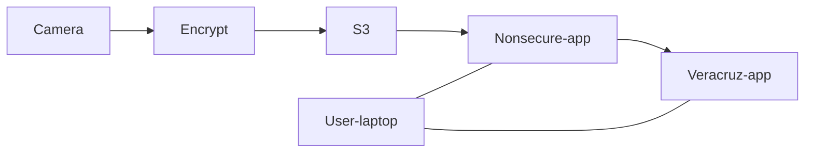
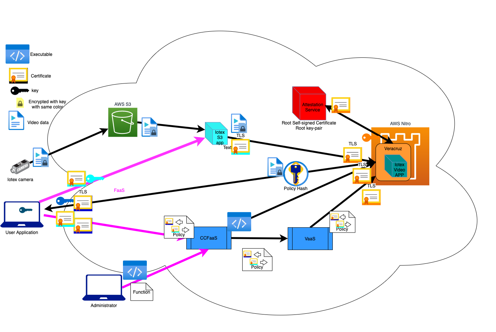
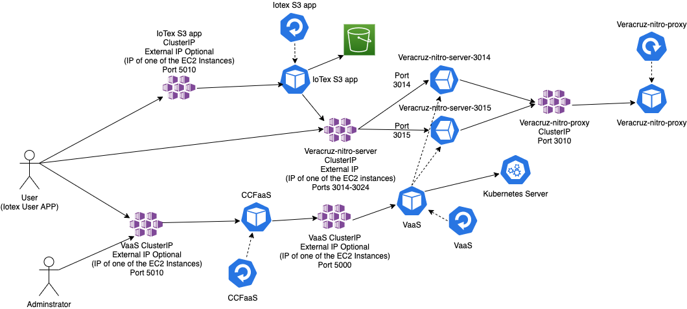
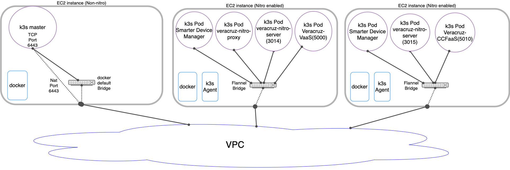

# i-poc

This is the high level Iotex PoC description.  The key here is that the processing of the video is triggered by the user from their laptop (in the example), and the object detection happens in Nitro Enclaves on top of Veracruz.  



The following figure describe the application in more detail. The figure shows the components, communications path and information exchanged.
In the figure if a symbol is close to an entity, it means that this entity is sending that data (symbol).
Timeline is not shown in the diagram and it will be described later.

<center>



</center>

A timeline of a full operation is described below.

1. Administrator register privacy preserving functions at CCFaaS
   * Function name, application code (wasm), hash, input/output requirements of the application code and others.
1. User application creates a temporary key and certificate to be used by the Iotex S3 app application to access the Veracruz instance.
   * Light blue key and certificate on the diagram
1. User application creates a json object with the following information:
   * name of function to be executed in privacy-preserving environment (object detection for example)
   * a certificate for each input/output file of the privacy-preserving environment
     * In the object detection example described: 
        * user application certificate as output
          * Dark blue certificate
        * temporary created certificate as input
          * Light blue certificate
1. User application executes a remote procedure call request to the CCFaaS service with previously created json object 
   * Lower pink FaaS arrow
1. CCFaaS validates the request and creates a valid policy request json object based on the request and internal database (object detection application code, certificates to load the code into Veracruz)
1. CCFaaS executes a RPC at VaaS requesting an instance of Veracruz running that policy
1. VaaS validates that request and starts a Veracruz instance in the allocated EC2 nitro with a complete policy
1. VaaS returns the complete policy to CCFaaS
1. CCFaaS loads the desired Veracruz user application code (object detection) into the Veracruz instance directly or asks another service to load it.
1. CCFaaS returns created Veracruz policy to User Application After application program code is loaded
1. CCFaaS and VaaS waits for the next request (it will not interact with this request anymore)
1. User Application receives the policy 
1. User Application connects directly to Veracruz instance (using the connection information provided in the policy) and verify that the policy hash matches and the certificate provided by Veracruz instance is valid (attested by the proxy)
1. Veracruz user app creates a temporary key and sends the key (Veracruz user app key) to output file
1. User Application connects to the output file of Veracruz instance and receives key (Veracruz user app key)
1. User Application encrypts the Iotex video decoding key  with the Veracruz user app key
1. User application creates a json object with the following information:
   * AWS S3 bucket, file name of the desired video and credentials to access the file
   * Veracruz instance endpoint (host, IP).
   * temporary certificate and key generated previously to access Veracruz instance
   * encrypted video key
1. User application executes a remote procedure call request to the Iotex S3 app with previously created json object
   * Upper pink FaaS arrow
1. Iotex S3 app starts an instance of itself that connects to AWS S3 and  Veracruz instance and sends the encrypted key and then reads the video file and sends it to the Veracruz instance
1. Veracruz instance process the video and send the results to the output file
1. Iotex S3 app instance closes the connection to Veracruz at the end of the file and terminates itself.
1. User application receives the last results and terminates the Veracruz instance
1. EC2 nitro instance is returned to the pool of free instances to be allocated.

# Veracruz Policy

Veracruz Policy is divided intro three parts: Infrastructure policy, Program policy and User policy. 

* Infrastructure policy describes the Veracruz instance: endpoint that has this policy, runtime properties (hash and others) and which proxy attestation server is used by this Veracruz instance.
* Program policy describe the executables used on the computation. For each executable the policy has the identity (certificate) of the entity allowed to load this executable, name, hash, inputs and outputs of the program and file rights that the program has on each input/output file.
* User policy describe identities (certificates) of the entities that can communicate with that Veracruz instance, which files and in which action (read/write/etc) it is allowed to interact with.

## Policy examples and syntax

The syntax of the policies will be described using [json Schema](ttps://json-schema.org).

* User Policy
   
    ```json
   {
     "function": "objectdetection",
     "instanceid": "idtest",
     "identities": [
       {
         "certificate": "-----BEGIN CERTIFICATE-----\nXXXXXXXXX\n-----END CERTIFICATE-----",
         "file_rights": [
           {
             "file_name": "input-0",
             "rights": 533572
           },
           {
             "file_name": "output",
             "rights": 8198
           }
         ]
       }
     ]
   }
   ```
 
   The following json-schema describes the schema allowed. 

   ```json
   json_policy_input_schema = {
       "$schema": "https://json-schema.org/draft/2020-12/schema",
       "type": "object",
       "properties": {
           "instanceid": { "type": "string"},
           "function": { "type": "string"},
           "identities":  json_identity_schema,
       },
       "required": ["function","instanceid","identities"],
       "additionalProperties": False
   }
   json_identity_schema = {
       "type": "array",
       "items" : {
            "type": "object",
            "properties": {
                "file_rights": json_file_rights_schema,
                "certificate":  { "type":"string" },
            },
            "required": ["file_rights","certificate"],
            "additionalProperties": False
       },
       "additionalProperties": False
   }
   json_file_rights_schema = {
       "type": "array",
       "items" : {
           "type": "object",
           "properties": {
                "file_name": { "type": "string"},
                "rights": { "type": "integer"},
           },
           "additionalProperties": False
       },
       "additionalProperties": False
   }
   ```

   * function: identifies the registered function to instantiate
   * instanceid: unique name for this instance
   * identities: list of certificates and permissions allowed for each certificate
   * certificates: x509 certificate in PEM format (currently veracruz-client only supports RSA certificates)
   * file_rights: List of filenames and permissions associated with that file for this identity
   * file_name: file that permissions apply (this file should exist on the registered function):
   * rights: Permissions that will be granted for that identity and file_name. Interpreted as a binary number according to the table below
      ```
      FD_DATASYNC               = 2^0 = 1
      FD_READ                   = 2^1 = 2
      FD_SEEK                   = 2^2 = 4
      FD_FDSTAT_SET_FLAGS       = 2^3 = 8
      FD_SYNC                   = 2^4 = 16
      FD_TELL                   = 2^5 = 32
      FD_WRITE                  = 2^6 = 64
      FD_ADVISE                 = 2^7 = 128
      FD_ALLOCATE               = 2^8 = 256
      PATH_CREATE_DIRECTORY     = 2^9 = 512
      PATH_CREATE_FILE          = 2^10 = 1024
      PATH_LINK_SOURCE          = 2^11 = 2048
      PATH_LINK_TARGET          = 2^12 = 4096
      PATH_OPEN                 = 2^13 = 8192
      FD_READDIR                = 2^14 = 16384
      PATH_READLINK             = 2^15 = 32768
      PATH_RENAME_SOURCE        = 2^16 = 65536
      PATH_RENAME_TARGET        = 2^17 = 131072
      PATH_FILESTAT_GET         = 2^18 = 262144
      PATH_FILESTAT_SET_SIZE    = 2^19 = 524288
      PATH_FILESTAT_SET_TIMES   = 2^20 = 1048576
      FD_FILESTAT_GET           = 2^21 = 2097152
      FD_FILESTAT_SET_SIZE      = 2^22 = 4194304
      FD_FILESTAT_SET_TIMES     = 2^23 = 8388608
      PATH_SYMLINK              = 2^24 = 16777216
      PATH_REMOVE_DIRECTORY     = 2^25 = 33554432
      PATH_UNLINK_FILE          = 2^26 = 67108864
      POLL_FD_READWRITE         = 2^27 = 134217728
      SOCK_SHUTDOWN             = 2^28 = 268435456
      ```
      In the example above:

         * 533572 = 2^2 + 2^6 + 2^10 + 2^13 + 2^19
            * FD_READ
            * FD_WRITE
            * PATH_CREATE_FILE
            * PATH_OPEN
            * PATH_FILESTAT_SET_SIZE
         * 8198 = 2^1 + 2^2 + 2^13 
            * FD_READ
            * FD_SEEK
            * PATH_OPEN.

* Program Policy

    ```json
    {
      "function": "objectdetection",
      "execution_strategy": "Interpretation",
      "programs": [
        {
          "id": 0,
          "pi_hash": "3fc011587de8a340c0ee36d733c3e52a42babc5fe6b12a074d94204495fd5877",
          "program_file_name": "linear-regression.wasm",
          "file_rights": [
            {
              "file_name": "input-0",
              "rights": 8198
            },
            {
              "file_name": "output",
              "rights":  33572
            }
          ]
        }
      ]
    }
    ```
    The following json-schema describes the schema allowed. 

    ```json
    json_policy_input_schema = {
        "$schema": "https://json-schema.org/draft/2020-12/schema",
        "type": "object",
        "properties": {
            "function": { "type": "string"},
            "execution_strategy": { "type": "string"},
            "programs":  json_program_schema,
            "data_files": json_data_file_schema
            }
        },
        "required": ["function","execution_strategy","programs"],
        "additionalProperties": False
    }

    json_data_file_schema = {
        "type": "array",
        "items" : {
             "type": "object",
             "properties": {
                 "data_file":  { "type":"string" },
                 "pi_hash":  { "type":"string" },
                 "priority": { "type":"integer" }
             },
             "required": ["pi_hash","data_file"],
             "additionalProperties": False
        },
        "additionalProperties": False
    }

    json_program_schema = {
        "type": "array",
        "items" : {
             "type": "object",
             "properties": {
                 "file_rights": json_file_rights_schema,
                 "id": { "type":"integer" },
                 "pi_hash":  { "type":"string" },
                 "program_file_name":  { "type":"string" },
             },
             "required": ["file_rights","id","pi_hash","program_file_name"],
             "additionalProperties": False
        },
        "additionalProperties": False
    }
 
    json_file_rights_schema = {
        "type": "array",
        "items" : {
            "type": "object",
            "properties": {
                 "file_name": { "type": "string"},
                 "rights": { "type": "integer"},
            },
            "additionalProperties": False
        },
        "additionalProperties": False
    }
    ```
   * function: identifies the function name to register
   * execution_strategy: normally "Interpretation" but other modes may be supported in the future
   * programs: list of programs (executables) that is part of the computation for this function (all of them are instantiated for this function to execute correctly)
   * file_rights: List of filenames and permissions associated with this program
   * pi_hash: sha256 hash of the executable or data file
   * data_files: list of optional data files to be loaded into the programs. The order they are loaded are determined by the priority, lower numbers before higher numbers, same numbers are loaded in random order. 
   * data_file: name of the file to be loaded and also the name of input file of the program
   * priority: (optional field) lower numbers will have higher priority on loading 
   * program_file_name: name for the program as known by Veracruz
   * file_name: file that permissions apply (this file should exist on the registered function):
   * rights: Permissions that will be granted for that identity and file_name. Interpreted as a binary number according to the table above

* VaaS policy (policy used by VaaS to create a Veracruz instance)

     ```json
     {
         "ciphersuite": "TLS_ECDHE_ECDSA_WITH_CHACHA20_POLY1305_SHA256",
         "debug": false,
         "enable_clock": true,
         "execution_strategy": "Interpretation",
         "identities": [
             {
                 "certificate": "-----BEGIN CERTIFICATE-----\nXXXXXXXXX\n-----END CERTIFICATE-----",
                 "file_rights": [
                     {
                         "file_name": "linear-regression.wasm",
                         "rights": 533572
                     }
                 ],
                 "id": 0
             },
             {
                 "certificate": "-----BEGIN CERTIFICATE-----\nXXXXXXXXX\n-----END CERTIFICATE-----",
                 "file_rights": [
                     {
                         "file_name": "input-0",
                         "rights": 533572
                     }
                 ],
                 "id": 1
             },
             {
                 "certificate": "-----BEGIN CERTIFICATE-----\nXXXXXXXXX\n-----END CERTIFICATE-----",
                 "file_rights": [
                     {
                         "file_name": "output",
                         "rights": 8198
                     }
                 ],
                 "id": 2
             }
         ],
         "programs": [
             {
                 "file_rights": [
                     {
                         "file_name": "input-0",
                         "rights": 8198
                     },
                     {
                         "file_name": "output",
                         "rights": 533572
                     }
                 ],
                 "id": 0,
                 "pi_hash": "3fc011587de8a340c0ee36d733c3e52a42babc5fe6b12a074d94204495fd5877",
                 "program_file_name": "linear-regression.wasm"
             }
         ]
     }

    ```
    The following json-schema describes the schema allowed. 

    ```json
    json_policy_input_schema = {
        "$schema": "https://json-schema.org/draft/2020-12/schema",
        "type": "object",
        "properties": {
            "instance_id": { "type": "string"},
            "ciphersuite": { "type": "string"},
            "debug": { "type": "boolean"},
            "enable_clock": { "type": "boolean"},
            "execution_strategy": { "type": "string"},
            "identities": json_identity_schema,
            "programs":  json_program_schema,
        },
        "required": ["ciphersuite","debug","enable_clock","execution_strategy","identities","programs"],
        "additionalProperties": False
    }

    json_identity_schema = {
        "type": "array",
        "items" : {
            "type": "object",
            "properties": {
                 "certificate": { "type": "string"},
                 "file_rights": json_file_rights_schema,
                 "id": { "type":"integer" },
            },
            "required": ["certificate","file_rights","id"],
            "additionalProperties": False
        },
        "additionalProperties": False
    }

    json_program_schema = {
        "type": "array",
        "items" : {
             "type": "object",
             "properties": {
                 "file_rights": json_file_rights_schema,
                 "id": { "type":"integer" },
                 "pi_hash":  { "type":"string" },
                 "program_file_name":  { "type":"string" },
             },
             "required": ["file_rights","id","pi_hash","program_file_name"],
             "additionalProperties": False
        },
        "additionalProperties": False
    }
    json_file_rights_schema = {
        "type": "array",
        "items" : {
            "type": "object",
            "properties": {
                 "file_name": { "type": "string"},
                 "rights": { "type": "integer"},
            },
            "additionalProperties": False
        },
        "additionalProperties": False
    }
    ```
   * id: allows identification of this instance for the purpose of VaaS
   * ciphersuite: identifies what are the algorithms to be used for cryptographic operations (TLS, hashing,  keys signing, etc..)
   * debug: True runs in debug mode, false runs in normal mode
   * enable_clock: True allows wasm program to use the read the OS clock
   * execution_strategy: normally "Interpretation" but other modes may be supported in the future
   * programs: list of programs (executables) that is part of the computation for this function (all of them are instantiated for this function to execute correctly)
   * file_rights: List of filenames and permissions associated with this program
   * pi_hash: sha256 hash of the executable
   * program_file_name: name for the program as known by Veracruz
   * file_name: file that permissions apply (this file should exist on the registered function):
   * rights: Permissions that will be granted for that identity and file_name. Interpreted as a binary number according to the table above

* Full policy (policy returned by CCFaaS and VaaS and used in Veracruz instance)

     ```json
     {
       "ciphersuite": "TLS_ECDHE_ECDSA_WITH_CHACHA20_POLY1305_SHA256",
       "debug": false,
       "enable_clock": true,
       "enclave_cert_expiry": {
         "day": 23,
         "hour": 23,
         "minute": 44,
         "month": 12,
         "year": 2021
       },
       "execution_strategy": "Interpretation",
       "identities": [
         {
           "certificate": "-----BEGIN CERTIFICATE-----\nXXXXXXXXX\n-----END CERTIFICATE-----",
           "file_rights": [
             {
               "file_name": "linear-regression.wasm",
               "rights": 533572
             }
           ],
           "id": 0
         },
         {
           "certificate": "-----BEGIN CERTIFICATE-----\nXXXXXXXXX\n-----END CERTIFICATE-----",
           "file_rights": [
             {
               "file_name": "input-0",
               "rights": 533572
             },
             {
               "file_name": "output",
               "rights": 8198
             }
           ],
           "id": 1
         }
       ],
       "programs": [
         {
           "file_rights": [
             {
               "file_name": "input-0",
               "rights": 8198
             },
             {
               "file_name": "output",
               "rights": 533572
             }
           ],
           "id": 0,
           "pi_hash": "3fc011587de8a340c0ee36d733c3e52a42babc5fe6b12a074d94204495fd5877",
           "program_file_name": "linear-regression.wasm"
         }
       ],
       "proxy_attestation_server_url": "veracruz-nitro-proxy:3010",
       "proxy_service_cert": "-----BEGIN CERTIFICATE-----\nXXXXXXXXX\n-----END CERTIFICATE-----",
       "runtime_manager_hash_nitro": "89bad60af6e4bd934dc7705b7187b828631092c151b967c0b1638c5567234acd",
       "runtime_manager_hash_sgx": "",
       "runtime_manager_hash_tz": "",
       "std_streams_table": [
         {
           "Stdin": {
             "file_name": "stdin",
             "rights": 8198
           }
         },
         {
           "Stdout": {
             "file_name": "stdout",
             "rights": 533572
           }
         },
         {
           "Stderr": {
             "file_name": "stderr",
             "rights": 533572
           }
         }
       ],
       "veracruz_server_url": "veracruz-nitro-server:3014"
     }
     ```
     The additional fields returned with the policy are:
 
     * enclave_cert_expiry: enclave certificate expiration date
     * proxy_attestation_server_url: Proxy attestation server that this enclave got the attestation certificate from
     * proxy_service_cert: Proxy server certificate for the key that signed the attestation certificate
     * runtime_manager_hash_nitro: Hash for the Veracruz nitro enclave runtime that is running on this enclave
     * runtime_manager_hash_sgx:  Hash for the Veracruz sgx enclave runtime that is running on this enclave
     * runtime_manager_hash_tz" Hash for the Veracruz trustzone enclave runtime that is running on this enclave
     * std_streams_table: stdin, stdout and stderr permissions for the program running inside the enclave (function)

# VaaS and CCFaaS description

## VaaS (Veracruz as a Service)

VaaS provides a REST (CD) interface that allows multiple instances of Veracruz to be allocated, attested and loaded with a policy in a kubernetes based nitro-enabled cloud. All the instances will be using the same endpoint server with a specific port allocated for each instance. A single DNS enabled address is required.

VaaS require a valid VaaS policy (essentially a Program policy and User policy together) as input and provides a Veracruz instance loaded with a full policy (Infrastructure policy is added by VaaS) returning that policy if the instance is successfully allocated.

|Action	| HTTP method | URL| URL Parametera | Input Object | Output Object |
| -- | --- | --- | --- | --- | --- |
|CREATE	|POST |	/veracruz | | VasS Policy | |
|READ |	GET | /veracruz |  instance_Id instance_Hash | | List of Veracruz instances |
|READ|	GET | /veracruz/\<name\> | | Statis of Veracruz Instance |
|DELETE	|DELETE | /veracruz/\<name\> |  instance_id instance_hash | | |

## CCFaaS (Confidential Computing Function as a Service)

CCFaaS provides a REST (CRD) interface that allows confidential computing functions to be instantiated on a Veracruz environment. 
CCFaaS has three main concepts. Function, Program and Instances. Function represents a computation to be executed in Veracruz and it is mainly the program policy information. Program allows the CCFaaS to pre-load executables into Veracruz, and instance is a instance of a function running in a Veracruz. An instance to be created requires a user policy a reference to a registered function.
Multiple instances can be created from the same registered function. 

|Action	| HTTP method | URL| URL Parametera | Input Object | Output Object |
| -- | --- | --- | --- | --- | --- |
| CREATE | POST	 | /function  | | CCFaaS policy | |
| READ | GET	 | /function  | | | List of functions registered |
| READ | GET	   | /function/\<name\> |  | CCFaaS policy  |
| DELETE  | DELETE | /function/\<name\> | |   | |
| CREATE | POST	 | /function/\<name\>/program/\<progname\> |  | Program binary |
| READ | GET	` | /function/\<name\>/program | 	 | 	 | List of programs registered |
| READ | GET	 | /function/\<name\>/program/\<progname\> | |	 | Status of program |
| DELETE | DELETE | /function/\<name\>/program/\<progname\> |  |
| CREATE | POST	 | /function/\<name\>/data_file/\<data_file\> | | Data binary  |
| READ | GET	 | /function/\<name\>/data_file	| | | List of data files registered |
| READ | GET	 | /function/\<name\>/data_file/\<data_file\> ||  | Status of data file |
| DELETE | DELETE | /function/\<name\>/data_file/\<data_file\> |  |
| CREATE | POST	 | /instance |  | User Policy |
| READ | GET	 | /instance | |  | List of instances |
| READ | GET	 | /instance/\<name\> | |  | Status of instance |
| DELETE | DELETE | /instance/\<name\> | | |  |

# Running demo application (including Veracruz) as a service under k3s/k8s 

On this environment a full orchestrated end-to-end application is deployed using containers on a kubernetes (k8s or k3s) infrastructure on the cloud.

<center>



</center>


<center>



</center>

## Infrastructure

### Deploying on AWS EKS

* Infrastructure
  * Follow this instructions [AWS Nitro Enclaves on EKS](https://superorbital.io/journal/aws-nitro-enclaves-in-k8s-pods/)
  * EKS will provide autoscaling

### Deploying on EC2 instances on an user installed k8s/k3s

* Infrastructure
  * At least 1 server and 1 node with the nodes that are supporting Veracruz instances must be nitro enabled. 
* A simple installation of k3s on AWS EC2 is described at [Zero to k3s Kubeconfig in seconds with k3sup](https://rancher.com/blog/2019/k3s-kubeconfig-in-seconds/)
* Use kubernetes documentation on [Getting started](https://kubernetes.io/docs/setup/) or [Production environment](https://kubernetes.io/docs/setup/production-environment/) to install a working kubernetes on AWS EC2 instances.

## Veracruz services

  * Attestation service 
     * 1 copy started by a deployment service on k3s/k8s and a service (clusterIP) veracruz-nitro-proxy.
     * Only accessible to containers on the same cluster 
     * Final solution requires it to run in an acceptable infrastructure that is different from where the enclaves are running (Nitro, SGX or trustzone)
  * Veracruz nitro instance.
     * Uses the docker AWS Nitro Veracruz image started as veracruz
     * The policy is provided to the container as a configmap and the networking is configured by a service and an endpointslice.
       * All Veracruz instances will be accessed by a single DNS entry but each one will use a different port, this information is reflected on the policy 
     * Undefined if active directory or passive one, assuming passive now in case of active we need the active directory address.
     * Current limitation of Veracruz require policy before attestation, so the attestation process start only after policy is inserted.
     * Started as individual pods
  * VaaS
     * provides a REST (CRD) API with a single entrypoint
     * Allocates a Veracruz instance by creating configmap, pod and entrypointslice objects
     * deployed as k8s deployment
  * CCFaaS
     * provides a REST (CRD) API with a single entrypoint
     * Provides a FaaS-like interface for veracruz. Currently three objects are supported: Functions, programs and instances.
       * Functions provide an abstraction for a computation function that can be executed in Veracruz. It describes which programs and I/O interfaces are required.
       * Programs are wasm executables. In the current implementation, the ones uploaded on CCFaaS will be automatically uploaded to an allocated instance when the function is instantiated.
       * Instances represents a function that is loaded in a Veracruz instance 
     * deployed as k8s deployment
  * Iotex S3 app
     * provides a REST API with a single entrypoint
     * Starts a transfer from a S3 bucket/file to a Veracruz instance
     * deployed as k8s deployment
  * Iotex Video App
     * wasm application that process the video producing the desired output for the end user
           

### Installing Veracruz services on k8s/k3s

1. Clone the repository https://gitlab.com/arm-research/security/i-poc.git 
1. Move to directory i-poc
   ```bash
   cd i-poc
   ```
1. Copy file i-poc/main-k3s/config.vars.template to i-poc/i-poc/main-k3s/config.vars and update the values according to your installation
1. If desired to create the container images locally, execute
   ```bash
   make images
   ```
1. The following step create all the keys, certificates and update all the YAML files from the templates and loads them into k8s/k3s
   ```bash
   make k8s-all
   ```
1. If more control is desired change to directory i-poc/main-k3s
   
   ```bash
   make k8s-smarter-device-manager
   make k8s-attestation-service
   make k8s-vaas
   make k8s-ccfaas
   make k8s-iotex-s3-app
   ```

   there is also <entry>-check to verify if the services are running correctly


#### Smarter-device-manager

Even oj EKS a new updated configuration of smarter-device-manager need to be be installed
1. Load the yaml files for smarter-device-manager
   ```bash
   kubectl apply -f smarter-device-manager-configmap-ec2-nitro.yaml
   kubectl apply -f smarter-device-manager-ds-with-configmap-ec2-nitro.yaml
   ```

1. Verify that everything is installed and running
   ```bash
   kubectl get all
   ```
   The result should be at least those object, at least one pod per nitro-enabled node should exist, additional objects can exist if other things are running
   ```
   NAME                                         READY   STATUS    RESTARTS   AGE
   pod/smarter-device-manager-ec2-nitro-XXXXX   1/1     Running   XX         XX
   
   NAME                            TYPE        CLUSTER-IP      EXTERNAL-IP    PORT(S)                      AGE
   service/kubernetes              ClusterIP   X.X.X.X         <none>         443/TCP                      XX
   
   NAME                                              DESIRED   CURRENT   READY   UP-TO-DATE   AVAILABLE   NODE SELECTOR                    AGE
   daemonset.apps/smarter-device-manager-ec2-nitro   X         X         X       X            X           smarter-device-manager=enabled   X
   ```
   There should be 1 pod/smarter-device-manager-ec2-nitro-XXXXX per node on the k3s cluster. All the nodes that are nitro enabled should have these resources when described
   ```bash
   kubectl describe node <node name>
   ```
   The node should have the label "smarter-device-manager=enabled" 
   ```
   Labels:             beta.kubernetes.io/arch=amd64
                       beta.kubernetes.io/instance-type=k3s
                       beta.kubernetes.io/os=linux
                       enclave.example.com/type=nitro
                       kubernetes.io/arch=amd64
                       kubernetes.io/hostname=ip-172-31-4-186
                       kubernetes.io/os=linux
                       node.kubernetes.io/instance-type=k3s
                       smarter-device-manager=enabled
   ```
   If the label do not appear use the command
   ```bash
   kubectl label node <node name> smarter-device-manager=enabled
   ```
   When correct the following resources should be available:
   ```
   smarter-devices/nitro_enclaves:  1
   smarter-devices/rtc0:            20
   smarter-devices/ttyS0:           1
   smarter-devices/ttyS1:           1
   smarter-devices/ttyS2:           1
   smarter-devices/ttyS3:           1
   smarter-devices/vsock:           1
   ```

#### Attestation service

1. Load the yaml files for the attestation service
   ```bash
   kubectl apply -f veracruz-nitro-proxy-configmap.yaml
   kubectl apply -f veracruz-nitro-proxy-service.yaml
   kubectl apply -f veracruz-nitro-proxy-deploy.yaml
   ```
1. Verify that everything is installed and running
   ```bash
   kubectl get all
   ```
   The result should be at least those objects, additional objects can exist if other things are running
   ```
   NAME                                         READY   STATUS    RESTARTS   AGE
   pod/smarter-device-manager-ec2-nitro-XXXXX   1/1     Running   XX         XX
   pod/veracruz-nitro-proxy-XXXXXXXXXXXXXXXXX   1/1     Running   XX         XX
   
   NAME                            TYPE        CLUSTER-IP      EXTERNAL-IP    PORT(S)                      AGE
   service/kubernetes              ClusterIP   X.X.X.X         <none>         443/TCP                      XX
   service/veracruz-nitro-proxy    ClusterIP   X.X.X.X         <none>         3010/TCP                     XX
   
   NAME                                              DESIRED   CURRENT   READY   UP-TO-DATE   AVAILABLE   NODE SELECTOR                    AGE
   daemonset.apps/smarter-device-manager-ec2-nitro   X         X         X       X            X           smarter-device-manager=enabled   X
   
   NAME                                   READY   UP-TO-DATE   AVAILABLE   AGE
   deployment.apps/veracruz-nitro-proxy   1/1     1            1           XX
   
   NAME                                             DESIRED   CURRENT   READY   AGE
   replicaset.apps/veracruz-nitro-proxy-XXXXXXXXX   1         1         1       XX
   ```

#### VaaS

1. Load the yaml files for the VaaS
   ```bash
   kubectl apply -f veracruz-vaas-app-service.yaml
   kubectl apply -f veracruz-vaas-app-deploy.yaml
   kubectl apply -f veracruz-nitro-server-service.yaml

   ```
1. Verify that everything is installed and running
   ```bash
   kubectl get all
   ```
   The result should be at least those objects, additional objects can exist if other things are running
   ```
   NAME                                         READY   STATUS    RESTARTS   AGE
   pod/smarter-device-manager-ec2-nitro-XXXXX   1/1     Running   XX         XX
   pod/veracruz-nitro-proxy-XXXXXXXXXXXXXXXXX   1/1     Running   XX         XX
   pod/vaas-server-app-XXXXXXXXXXXXXXXX         1/1     Running   XX         XX
   
   NAME                            TYPE        CLUSTER-IP      EXTERNAL-IP    PORT(S)                      AGE
   service/kubernetes              ClusterIP   X.X.X.X         <none>         443/TCP                      XX
   service/veracruz-nitro-proxy    ClusterIP   X.X.X.X         <none>         3010/TCP                     XX
   service/veracruz-nitro-server   ClusterIP   X.X.X.X         X.X.X.X        3014/TCP,3015/TCP,3016/TCP   XX
   service/vaas-server-app         ClusterIP   X.X.X.X         X.X.X.X        5000/TCP                     XX
   
   NAME                                              DESIRED   CURRENT   READY   UP-TO-DATE   AVAILABLE   NODE SELECTOR                    AGE
   daemonset.apps/smarter-device-manager-ec2-nitro   X         X         X       X            X           smarter-device-manager=enabled   X
   
   NAME                                   READY   UP-TO-DATE   AVAILABLE   AGE
   deployment.apps/veracruz-nitro-proxy   1/1     1            1           XX
   deployment.apps/vaas-server-app        1/1     1            1           XX
   
   NAME                                             DESIRED   CURRENT   READY   AGE
   replicaset.apps/veracruz-nitro-proxy-XXXXXXXXX   1         1         1       XX
   replicaset.apps/vaas-server-app-XXXXXXXXXX       1         1         1       XX
   ```

#### CCFaaS

1. Load the yaml files for the CCFaaS
   ```bash
   kubectl apply -f veracruz-ccfaas-app-configmap.yaml
   kubectl apply -f veracruz-ccfaas-app-service.yaml
   kubectl apply -f veracruz-ccfaas-app-deploy.yaml

   ```
1. Verify that everything is installed and running
   ```bash
   kubectl get all
   ```
   The result should be at least those objects, additional objects can exist if other things are running
   ```
   NAME                                         READY   STATUS    RESTARTS   AGE
   pod/smarter-device-manager-ec2-nitro-XXXXX   1/1     Running   XX         XX
   pod/veracruz-nitro-proxy-XXXXXXXXXXXXXXXXX   1/1     Running   XX         XX
   pod/vaas-server-app-XXXXXXXXXXXXXXXX         1/1     Running   XX         XX
   pod/ccfaas-server-app-XXXXXXXXXXXXXXXX       1/1     Running   0          XX
   
   NAME                            TYPE        CLUSTER-IP      EXTERNAL-IP    PORT(S)                      AGE
   service/kubernetes              ClusterIP   X.X.X.X         <none>         443/TCP                      XX
   service/veracruz-nitro-proxy    ClusterIP   X.X.X.X         <none>         3010/TCP                     XX
   service/veracruz-nitro-server   ClusterIP   X.X.X.X         X.X.X.X        3014/TCP,3015/TCP,3016/TCP   XX
   service/vaas-server-app         ClusterIP   X.X.X.X         X.X.X.X        5000/TCP                     XX
   service/ccfaas-server-app       ClusterIP   X.X.X.X         X.X.X.X        5010/TCP                     XX
   
   NAME                                              DESIRED   CURRENT   READY   UP-TO-DATE   AVAILABLE   NODE SELECTOR                    AGE
   daemonset.apps/smarter-device-manager-ec2-nitro   X         X         X       X            X           smarter-device-manager=enabled   X
   
   NAME                                   READY   UP-TO-DATE   AVAILABLE   AGE
   deployment.apps/veracruz-nitro-proxy   1/1     1            1           XX
   deployment.apps/vaas-server-app        1/1     1            1           XX
   deployment.apps/ccfaas-server-app      1/1     1            1           XX
   
   NAME                                             DESIRED   CURRENT   READY   AGE
   replicaset.apps/veracruz-nitro-proxy-XXXXXXXXX   1         1         1       XX
   replicaset.apps/vaas-server-app-XXXXXXXXXX       1         1         1       XX
   replicaset.apps/ccfaas-server-app-XXXXXXXXXX     1         1         1       XX
   ```

## Running applications on Veracruz

The iotex-user-app directory on the repository will execute the I-PoC example end-to-end according the timeline described above

1. Registering the function in CCFaaS

  ```bash
  ./register-function-example.sh
  ```

  The result should be simmilar to the one presented below
  ```bash
  Accessing CCFaaS at XXX.XXX.XXX.XXX:5010
    Getting function/linear-regression
    Not found
    linear-regression function with data below
    {
      "function": "linear-regression",
      "execution_strategy": "Interpretation",
      "programs": [
        {
          "id": 0,
          "pi_hash": "3fc011587de8a340c0ee36d733c3e52a42babc5fe6b12a074d94204495fd5877",
          "program_file_name": "linear-regression.wasm",
          "file_rights": [
            {
              "file_name": "input-0",
              "rights": 8198
            },
            {
              "file_name": "output",
              "rights": 533572
            }
          ]
        }
      ]
    }
    Register linear-regression function
        {
          "execution_strategy": "Interpretation",
          "function": "linear-regression",
          "programs": [
            {
              "file_rights": [
                {
                  "file_name": "input-0",
                  "rights": 8198
                },
                {
                  "file_name": "output",
                  "rights": 533572
                }
              ],
              "id": 0,
              "pi_hash": "3fc011587de8a340c0ee36d733c3e52a42babc5fe6b12a074d94204495fd5877",
              "program_file_name": "linear-regression.wasm"
            }
          ]
        }
    
    Create linear-regression  program linear-regression.wasm
        <p>function loaded!</p>
  ```

1. Running the example
    ```bash
    ./iotex-user-app.sh
    ```

    The result should be similar to one presented below
    ```bash
    CCFaaS in http://XXX.XXX.XXX.XXX:5010 and Iotex-s3 Faas in http://XXX.XXX.XXX.XXX:5020
    User certificate loaded from USERcert.pem and key from USERkey.pem
    S3 certificate created
    Creating instance URL=http://XXX.XXX.XXX.XXX:5010/instance
    Response = <Response [200]>
    Writing policy to policy_test1
    Creating s3 app URL=http://XXX.XXX.XXX.XXX:5020/s3_stream_veracruz
    execute: ./execute_program.sh policy_test1 USERcert.pem USERkey.pem  linear-regression.wasm linear-regression.dat.output
    writing RSA key
    /home/ubuntu/i-poc/iotex-user-app/veracruz-client policy_test1 --results linear-regression.wasm=linear-regression.dat.output --identity USERcert.pem --key USERkey.pem
    Loaded policy policy_test1 bf6469a15394ba244166fe1159883ba44ce9ebb714e267d0fe36d25f71116952
    Connecting to veracruz-nitro-server:3014
    Reading <enclave>/linear-regression.wasm into linear-regression.dat.output
    Shutting down enclave
    Deleting instance URL=http://172.31.4.186:5010/instance/test1
    ```

# WIP:

* Iotex Video App
  * Object detection wasm application is WIP
  * Cryptography inside the enclave is still WIP
  * Documentation of how to implement an application that can be compiled to wasm and deployable on Veracruz


# Possible future enhancements

* Use a DB to store persistent data from CCFaaS
* Remove CCFaaS instances if the corresponding Veracruz instance dies
* Allow installation within a defined namespace
* Convert YAML files to helm charts
